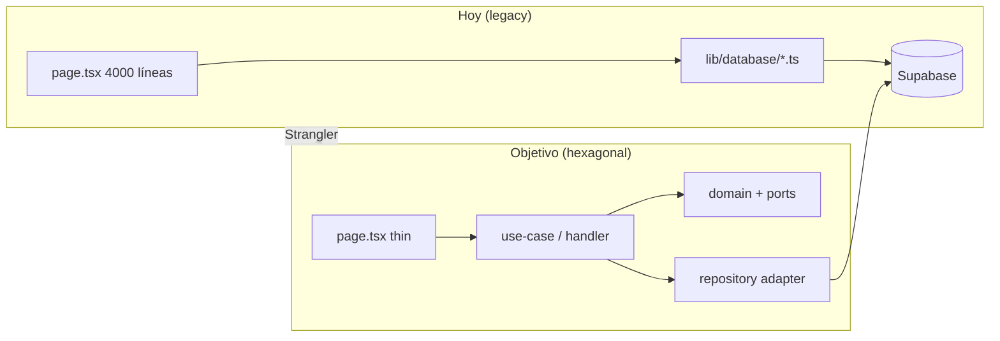

# ADR-004 — Arquitectura Hexagonal (Ports & Adapters)

| Campo | Valor |
|-------|-------|
| **Estado** | **Aprobado — prerequisito antes de avanzar implementación** |
| **Fecha** | 2026-06-18 |
| **Depende de** | ADR-001 (monolito modular), ADR-002 (dominio futuro) |
| **Complementa** | ADR-003 (API como adaptador de entrada) |

---

## Contexto

TC-ERP tiene **dos realidades de código coexistiendo**:

| Capa | Ubicación | Estado |
|------|-----------|--------|
| **Hexagonal parcial** | `src/modules/{recepcion,despacho,produccion,...}` | Esqueleto con DI, CQRS, agregados — **no cubre operación diaria** |
| **Legacy operativo** | `src/lib/database/*.ts` + `page.tsx` gigantes | **Lo que usa producción hoy** |

Sin una decisión explícita, cada CHG nuevo puede:
- Duplicar reglas en UI y en `lib/database`
- Acoplar Supabase/PostgreSQL al dominio
- Impedir escalar (extraer módulos, API Centro Documentos, workers batch)

**Requisito del negocio:** Muchas capacidades (PO, Lote Salida, finanzas por equipo, accesorios con/sin lote) **aún no existen**. Deben diseñarse desde cero **sobre hexagonal**, no extender el patrón legacy.

---

## Decisión

### 1. Patrón estructural obligatorio: **Arquitectura Hexagonal**

Cada **bounded context** (módulo) se organiza con el dominio en el centro y adaptadores en el borde:

```
                    ┌─────────────────────────────────────┐
  Driving adapters  │  UI (page.tsx)                      │
  (entrada)         │  API routes (/api/*)                │
                    │  Webhooks / Centro Documentos       │
                    └──────────────┬──────────────────────┘
                                   │ DTO / Command / Query
                    ┌──────────────▼──────────────────────┐
                    │  APPLICATION (casos de uso)         │
                    │  Orquestación, transacciones app    │
                    └──────────────┬──────────────────────┘
                                   │ entidades / reglas
                    ┌──────────────▼──────────────────────┐
                    │  DOMAIN (núcleo)                    │
                    │  Entidades, VOs, reglas, eventos    │
                    │  PORTS (interfaces) ────────────────┼──► otros módulos
                    └──────────────┬──────────────────────┘
                                   │ implementan ports
                    ┌──────────────▼──────────────────────┐
  Driven adapters   │  INFRASTRUCTURE                     │
  (salida)          │  Supabase repos, RPC, mappers       │
                    │  Legacy bridge, SAP file, ZKTeco    │
                    └─────────────────────────────────────┘
```

### 2. Relación con ADR-001

| ADR-001 | ADR-004 |
|---------|---------|
| **Qué** desplegar (monolito modular) | **Cómo** estructurar cada módulo |
| Bounded contexts, fases Strangler | Ports & Adapters dentro de cada context |
| Microservicios Fase 4 opcional | Infraestructura intercambiable sin tocar dominio |

**No son excluyentes:** monolito modular **con** hexagonal por módulo.

### 3. Reglas de dependencia (inviolables)

```
interfaces/  →  application/  →  domain/
infrastructure/  →  domain/   (implementa ports de domain/)
```

| Prohibido | Motivo |
|-----------|--------|
| `domain/` importa `infrastructure/` | Acopla negocio a Supabase |
| `domain/` importa `next/*` o React | Acopla negocio a framework |
| `page.tsx` importa `@/lib/database/*` directo (código nuevo) | Salta application layer |
| Reglas de negocio en `page.tsx` | Imposible testear y reutilizar |
| Módulo A importa repo concreto de módulo B | Usar **port** publicado por B |

### 4. Estrategia de coexistencia (Strangler)

| Tipo de cambio | Regla |
|----------------|-------|
| **Código nuevo** (PO, lote salida, finance-costing) | 100% hexagonal desde día 1 |
| **CHG en legacy** (sap-transfer, returns) | Caso de uso nuevo → delega a `lib/database` vía **LegacyBridge** en infrastructure hasta paridad RPC |
| **Páginas existentes** | Extraer hooks que llamen use cases; página solo presentación |
| **Feature flags** | `USE_HEXAGONAL_{MODULE}` para conmutar adaptador nuevo vs legacy |

### 5. Escalabilidad habilitada

| Escenario futuro | Qué cambia (solo adaptadores) |
|------------------|-------------------------------|
| API Centro Documentos (ADR-003) | Nuevo driving adapter `interfaces/api/v1/` |
| Worker batch SAP | Nuevo driving adapter `interfaces/worker/` |
| Extraer `sap-integration` a servicio | `infrastructure/` → cliente HTTP; dominio igual |
| Cambiar Supabase por otro store | Reimplementar driven adapters (repos) |
| Múltiples tenants / sucursales | `RequestContext` en application (ya existe en `shared/context`) |

El **dominio y casos de uso no se reescriben** al escalar infraestructura o despliegue.

---

## Estado actual vs objetivo



| Módulo | Hexagonal hoy | Legacy operativo | Prioridad migración |
|--------|---------------|------------------|---------------------|
| recepcion | Parcial (`modules/recepcion`) | `receptions.ts`, `/recepcion` | P2 |
| sap-transfer | Solo docs | `sapTransfers.ts`, backoffice | **P0 piloto** |
| returns | Solo docs | `returns.ts`, devoluciones | **P0 piloto** |
| warehouse / despacho | Parcial despacho | `warehouse.ts`, `/despacho` | P1 |
| production-order | Solo docs | No existe | Nuevo hexagonal |
| outbound-dispatch | Solo docs | `dispatches` sin lote | Nuevo hexagonal |
| finance-costing | Solo docs | `costs.ts` | Nuevo hexagonal |
| rrhh | Parcial | Mix API + páginas | P2 |

---

## Alternativas consideradas

| Alternativa | Descartada porque |
|-------------|-------------------|
| Solo capas (UI → Service → DB) | Sigue acoplando servicios a Supabase; no ports intercambiables |
| Clean Architecture sin ports explícitos | Menos claro al extraer microservicios |
| Seguir solo `lib/database` | No escala; reglas duplicadas en UI |
| Big-bang migración a hexagonal | Detiene operación; viola ADR-001 |

---

## Consecuencias

### Positivas

- Módulos futuros (PO, lote, finanzas) nacen escalables.
- Tests de dominio sin Supabase (mocks de ports).
- API Centro Documentos = otro adaptador, no fork de lógica.
- Extracción Fase 4 = cambiar wiring DI, no reescribir reglas.

### Costos

- Período dual: legacy bridge + repos nuevos.
- Disciplina en code review (import boundaries).
- DI container (`tsyringe`) debe crecer por módulo.

---

## Gobierno (añade a ADR-001)

1. Todo CHG debe indicar capa hexagonal tocada (ver plantilla impacto §12).
2. PR con `domain/` importando `infrastructure/` → **rechazar**.
3. Nuevo módulo sin carpeta `domain/ports/` → **rechazar**.
4. Guía detallada: [`hexagonal-layout.md`](hexagonal-layout.md).

---

## Fases hexagonal (dentro de ADR-001)

| Fase ADR | Entregable hexagonal |
|----------|---------------------|
| **0** | ADR-004 + layout + checklist PR |
| **1** | sap-transfer + returns: use cases + LegacyBridge + RPC adapters |
| **2** | Módulos nuevos (dispatch batch, PO) solo hexagonal; split UI |
| **3** | Retirar imports directos `lib/database` en páginas piloto |
| **4** | HTTP adapters para servicios extraídos |

---

## Referencias

- Layout detallado: `hexagonal-layout.md`
- Código esqueleto: `src/modules/recepcion/`, `src/shared/di/container.ts`
- Legacy: `src/lib/database/`
- ADR-001, ADR-003

---

## Aprobaciones

| Rol | Nombre | Fecha | Firma |
|-----|--------|-------|-------|
| Product Owner | | | |
| Tech Lead | | | |
