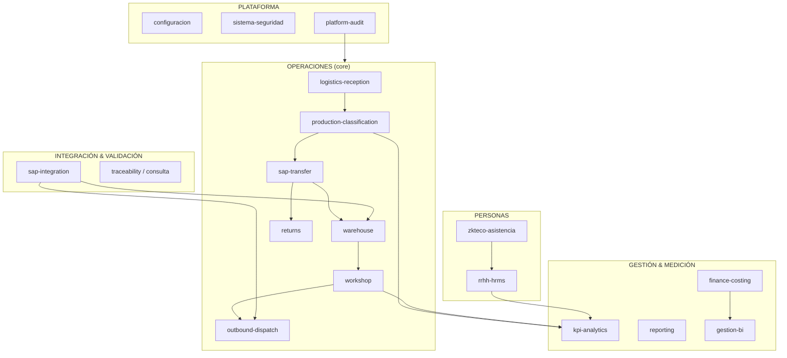

# Mapa del ecosistema TC-ERP — Todos los módulos

**Versión:** 1.0 | **Fecha:** 2026-06-18  
**Propósito:** Complementar ADR-001 y docs piloto (sap-transfer / returns) con el **panorama completo** del sistema, incluyendo SAP, KPI, RRHH, Finanzas, y conceptos PO / Lote.

---

## 1. Respuesta directa a la pregunta de alcance

| Área | ¿Estaba en análisis piloto? | ¿Existe en código? | Nivel madurez |
|------|----------------------------|---------------------|---------------|
| Flujo CAC / Backoffice / Bodega / Taller / Despacho | **Sí** (foco principal) | Sí | Medio — deuda notes/estados |
| Comparación archivo SAP vs TC | **Parcial** (mencionado) | Sí — módulo completo | Medio-alto — tablas 022 |
| KPI detalle por persona / día | **No** (piloto) | Sí — varios motores | Medio — depende de notes |
| Producción bajo solicitud **PO** | **No** | **No modelado** | **Diseño aprobado** — solo Taller + bodega |
| Salidas / entregas bajo **Lotes** | **Parcial** | Parcial — despacho por caja sin lote | **Diseño aprobado** — `dispatch_batches` |
| Recursos Humanos | **No** (piloto) | Sí — módulo HRMS | Medio-alto |
| Finanzas / costos | **No** (piloto) | Parcial — `activity_costs` | **Diseño aprobado** — pago por equipo despachado |
| **Reportes centralizados** | **No** | Disperso en UI (XLSX por pantalla) | **Diseño aprobado** — módulo `reporting` |

**Conclusión:** El piloto ADR-001 + sap-transfer/returns cubrió el **núcleo logístico-operativo CAC**. No sustituye un mapa enterprise completo. Este documento lo corrige.

**Patrón estructural:** Todo módulo nuevo o migrado sigue **Arquitectura Hexagonal** (ADR-004). Hoy coexisten `src/modules/*` (parcial) y `src/lib/database/*` (operativo).

---

## 2. Mapa de bounded contexts (visión enterprise)



---

## 3. Inventario de módulos por ruta

| Ruta | Bounded context | Responsabilidad | Docs |
|------|-----------------|-----------------|------|
| `/recepcion` | logistics-reception | Ingreso CAC/PX, guías | Pendiente |
| `/produccion/backoffice` | production-classification + sap-transfer | Clasificación, manifiesto | **Piloto** |
| `/produccion/taller` | workshop | Pipeline diagnóstico–QC–despacho interno | Pendiente |
| `/bodega/gestion` | warehouse | Cajas, ingreso, transferencias | Pendiente |
| `/bodega/inventario` | warehouse | Inventario | Pendiente |
| `/bodega/accesorios` | accessories | Accesorios y recovery boxes | Pendiente |
| `/despacho` | outbound-dispatch | Salida validada SAP | Pendiente |
| `/logistica/devoluciones` | returns | Devoluciones | **Piloto** |
| `/integracion-sap` | sap-integration | **Carga CSV SAP, matching, diferencias** | Pendiente |
| `/consulta` | traceability | Timeline por serie | Pendiente |
| `/configuracion/metas` | kpi-analytics | Metas taller por usuario | Pendiente |
| `/gestion/costos` | gestion-costos | Costos por actividad | Pendiente |
| `/gestion/bi` | gestion-bi | Dashboard gerencial | Pendiente — **mock parcial** |
| `/rrhh` | rrhh-hrms | Personal, planilla, asistencia | Pendiente |
| `/dashboard` | kpi-analytics | KPI engine operativo | Pendiente |
| `/sistema/seguridad` | platform | Roles y permisos | Pendiente |

---

## 4. Módulo: Integración SAP (comparación archivo)

### 4.1 Propósito
Comparar export **CSV/Excel SAP** contra inventario TC (series S1–S4, materiales, lotes stock SAP).

### 4.2 Tablas (migration 022)

| Tabla | Rol |
|-------|-----|
| `sap_uploads` | Archivo cargado, hash, métricas |
| `sap_validation_sessions` | Sesión de validación |
| `sap_validation_details` | Detalle por serie: material, **lote**, centro, almacén, coincidencia |
| `sap_validation_logs` | Bitácora |
| `service_orders.sap_integration_status` | Gate despacho (`Validado SAP`) |
| `series.sap_status` | Pendiente / Validado / Sin Coincidencia |

### 4.3 Columnas requeridas en archivo SAP (UI)

`Material`, `Texto breve`, `Número de serie`, `Centro`, `Almacén`, **`Lote`**, `Status del sistema`, **`Lote de stock`**

### 4.4 APIs

`/api/sap/sync`, `/dashboard`, `/history`, `/query`, `/tc-series`

### 4.5 Relación con sap-transfer (Documento SAP CAC)

| Concepto | sap-transfer (024) | sap-integration (022) |
|----------|---------------------|------------------------|
| Origen | Backoffice CAC — traslado interno | Export SAP corporativo |
| Tabla | `sap_transfer_documents` | `sap_validation_details` |
| Propósito | Agrupar equipos clasificados | Validar existencia vs SAP |
| Gate | Manifiesto + clasificación | Despacho (`Validado SAP`) |

**Riesgo arquitectónico:** Dos vocabularios "SAP" y dos "Lote" sin puente formal entre módulos.

---

## 5. Módulo: KPI y productividad por persona

### 5.1 Fuentes de datos actuales

| Componente | Archivo / tabla | Qué mide |
|------------|---------------|----------|
| KPI Engine | `kpi-engine.ts` | Recepciones, backoffice, taller — **por rango fecha** |
| Metas taller | `taller_kpi_goals` | Meta diaria/semanal por usuario, etapa, tech, modelo |
| Metas usuario | `user_kpi_targets` | Target genérico |
| Config metas | `/configuracion/metas` | CRUD metas |
| BI Dashboard | `/gestion/bi` | Vista gerencial — **datos demo en parte** |
| Audit logs | `erp_audit_logs` | Eventos por usuario (potencial gold source) |

### 5.2 Cómo se identifica "cuánto trabajó cada persona hoy"

| Área | Método actual | Problema |
|------|---------------|----------|
| Backoffice | Parse `receptions.notes` → `Por: Nombre` en bloque CLASIFICACIÓN | Frágil; no usa OS/audit estructurado |
| Recepción | `received_by`, conteos por carrier/source | OK parcial |
| Taller | Estados series + `taller_kpi_goals` vs producción | Mezcla etapas |
| Bodega | Inferido en KPI engine | Bajo detalle |

### 5.3 Objetivo arquitectónico KPI

```
domain_events (usuario, acción, entidad, timestamp)
    → proyección kpi_daily_worker_stats
    → dashboard / planilla / metas
```

**Regla:** Dejar de depender de `notes` para productividad individual.

### 5.4 Vínculo RRHH ↔ KPI

| RRHH | KPI |
|------|-----|
| `employees` + `profiles` | Identidad usuario |
| `zk_raw_logs` (marcaciones) | Horas reales trabajadas |
| `taller_kpi_goals.daily_goal` | Meta vs logrado |
| Planilla | Bono por metas (PlanillaTab) |

---

## 5.5 Módulo: Reporting (Reportes)

### 5.5.1 Problema hoy

Los reportes están **embebidos en cada pantalla** — generan Excel con `xlsx` directo desde `page.tsx`:

| Pantalla | Reporte |
|----------|---------|
| Backoffice | Histórico CAC clasificación |
| Recepción | Histórico CAC/PX |
| Despacho | Pendientes |
| Bodega inventario | Stock cajas |
| RRHH | Asistencia, ausencias, planilla |

**Consecuencia:** lógica duplicada, sin catálogo, sin permisos centralizados, difícil API Centro Documentos.

### 5.5.2 Diseño `reporting`

| Principio | Detalle |
|-----------|---------|
| Solo lectura | Providers consultan otros módulos vía **ports** |
| Hexagonal | Exporters (XLSX/CSV/PDF) = adaptadores salida |
| Catálogo | `report_definitions` + códigos canónicos |
| Separación | `kpi-analytics` calcula; `reporting` exporta; `gestion-bi` visualiza |

**Documentación:** `docs/modules/reporting/`, catálogo `report-catalog.md`

### 5.5.3 UI objetivo

- Portal `/reportes` — todos los reportes por categoría
- Botones legacy delegan a `GenerateReportHandler` (Strangler)
- API: `GET /api/v1/reports/{code}/export` (ADR-003)

---

## 6. Concepto PO (Solicitud de Producción) — Diseño aprobado (ADR-002 D1)

### 6.1 Decisión de negocio (2026-06-18)

| Regla | Detalle |
|-------|---------|
| **Alcance PO** | Solo **Taller** y equipos **en Bodega** |
| **Fuera de PO** | Backoffice CAC, recepción, clasificación inicial |
| **Origen** | Determinada en Taller; API futura → Centro de Documentos |
| **Implementación** | Pendiente — ver `modules/production-order/` |

### 6.2 Lo que existe hoy en código

| Entidad | Existe | Equivalente real |
|---------|--------|------------------|
| `production_orders` | **No** | — |
| `service_orders` (TC-XXX) | Sí | Orden por **equipo**, no por PO |
| `receptions` (lote) | Sí | Lote recepción, no PO |

### 6.3 Modelo objetivo

```
production_order (PO)
  ├── po_number
  ├── status: BORRADOR | APROBADA | EN_PROCESO | CERRADA
  └── links → service_orders.production_order_id
```

**Impacto:** Taller y finanzas (HH) filtran por PO; Backoffice CAC **no** usa PO.

---

## 7. Concepto "Lote" — Desambiguación obligatoria

En el sistema conviven **4 significados** de "Lote":

| # | Significado | Dónde | Tabla/campo |
|---|-------------|-------|-------------|
| L1 | **Lote recepción CAC** | Backoffice, recepción | `receptions` (UI "Lote ID") |
| L2 | **Sub-lote recepción** | HistoryTab | Notes "como parte de lote X" |
| L3 | **Lote SAP stock** | Archivo SAP / validación | `sap_validation_details.lote` |
| L4 | **Lote despacho/salida** | Despacho, accesorios | `dispatch_batches` — ver `outbound-dispatch` |

### 7.1 Glosario recomendado (evitar confusión)

| Término UI | Término dominio | Código |
|------------|-----------------|--------|
| Lote recepción | `ReceptionBatch` | `receptions.id` |
| Lote SAP | `SapStockBatch` | `sap_validation_details.lote` |
| Lote salida | `DispatchBatch` | `dispatch_batches` — caja sigue siendo unidad despacho |
| Documento SAP CAC | `SapTransferDocument` | `sap_transfer_documents` |

**Acción ADR:** Actualizar `glossary.md` con esta desambiguación.

---

## 8. Módulo: Recursos Humanos (RRHH)

### 8.1 Alcance funcional (`/rrhh`)

| Tab | Función |
|-----|---------|
| Live Dashboard | Asistencia tiempo real |
| Gestión Personal | Expediente empleados |
| Auditoría Asistencia | Marcaciones |
| Planilla | Cálculo nómina quincenal |
| Obligaciones | Deducciones/obligaciones |
| Catálogos | Deptos, cargos, tipos empleado |
| Reportes | Export/reportes HR |
| Justificaciones | Ausencias |
| Políticas | Config reglas HR |

### 8.2 Schema HR (migrations 020–024)

| Tabla | Rol |
|-------|-----|
| `employees` | Expediente completo |
| `hr_departments`, `hr_positions`, `hr_employee_types` | Organización |
| `zk_devices`, `zk_raw_logs`, `zk_commands` | Biométrico ZKTeco |
| Políticas enterprise | 021–023 |

### 8.3 Aislamiento del piloto CAC

RRHH es **contexto separado** con integración futura vía:
- Identidad (`employees` ↔ `profiles`)
- KPI productividad vs horas (`zk_raw_logs`)
- Costo mano de obra → Finanzas

**Documentación pendiente:** `docs/modules/rrhh-hrms/`

---

## 9. Módulo: Finanzas / Costos — Diseño aprobado (ADR-002 D3)

### 9.1 Decisión de negocio

| Regla | Detalle |
|-------|---------|
| **Pago operativo** | Por **equipo despachado**, no por actividad |
| **Análisis** | Costo ingreso + inventario + materiales + HH/PO vs despacho |
| **Módulo** | `finance-costing` — ver `modules/finance-costing/` |

### 9.2 Legacy (a migrar)

| Componente | Rol actual | Futuro |
|------------|------------|--------|
| `activity_costs` | Catálogo costo por actividad | Deprecar como base de pago |
| `/gestion/costos` | Dashboard básico | Leer `cost_ledger_entries` |
| Planilla RRHH | Nómina | Tarifa HH opcional |

### 9.3 Lo que NO existe

- Cuentas contables, asientos, AP/AR
- Integración SAP FI/CO

**Bounded context:** `finance-costing` (operativo) separado de `finance-erp` (futuro).

---

## 10. Roadmap documentación ampliado

| Prioridad | Módulo | Dependencias |
|-----------|--------|--------------|
| P0 | sap-integration | Gate despacho, archivo SAP |
| P0 | kpi-analytics | domain_events, RRHH |
| P0 | **reporting** | ✅ Doc — centralizar exports dispersos |
| P1 | production-order (PO) | ✅ Doc — `modules/production-order/` |
| P1 | outbound-dispatch + DispatchBatch | ✅ Doc — despacho caja + lote |
| P1 | finance-costing | ✅ Doc — pago por equipo despachado |
| P1 | accessories-dispatch | ✅ Doc — nuevo/recuperado con/sin lote |
| P2 | rrhh-hrms | ZKTeco, planilla |
| P2 | gestion-costos | → migrar a finance-costing |
| P3 | gestion-bi | Consume KPI + reporting; reemplazar mocks |
| ✅ Hecho | sap-transfer, returns | Piloto |

---

## 11. Impacto en ADR-001

ADR-001 **sigue válido** para estrategia monolito modular. Este mapa **extiende el alcance** de fases.

**Plan maestro consolidado:** [`roadmap-phases.md`](roadmap-phases.md)

| Fase | Ampliación |
|------|------------|
| 0 | Gobierno + ADR-004 hexagonal + docs módulos |
| 1 | RPC atómicas CAC + piloto hexagonal |
| 2 | Lote salida, PO, accesorios, reporting, split UI |
| 3 | domain_events, finance-costing, KPI, API v1 |
| 4 | Escala opcional (workers, microservicios) |

---

## Referencias código

- SAP integration: `src/app/(erp)/integracion-sap/`, `src/app/api/sap/`, migration 022
- KPI: `src/lib/database/kpi-engine.ts`, `kpi-goals.ts`, migration 015
- RRHH: `src/app/(erp)/rrhh/`, migrations 020–024
- Costos: `src/lib/database/costs.ts`, `gestion/costos/`
- BI: `src/app/(erp)/gestion/bi/page.tsx` (mock parcial)
- Reporting disperso: backoffice, recepción, despacho, rrhh — ver `modules/reporting/report-catalog.md`
