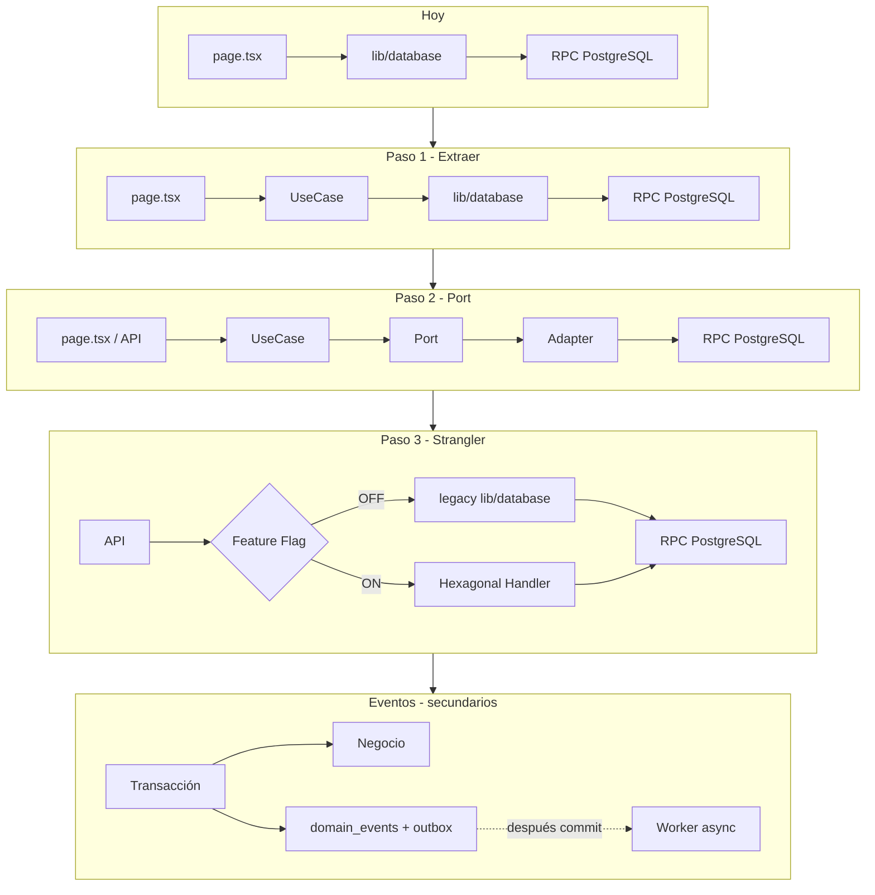

# Guía de migración TC-ERP — Playbook operativo

**Versión:** 1.0 | **Fecha:** 2026-06-22  
**Complementa:** [roadmap-phases.md](roadmap-phases.md) v1.1, [ADR-001](ADR-001-monolith-modular-evolution.md), [ADR-004](ADR-004-hexagonal-architecture.md)

Este documento describe **cómo migrar** sin detener operación. El roadmap dice **qué** entregar; este playbook dice **cómo moverse** con seguridad.

---

## Mapa: Fases de migración ↔ Roadmap

| Fase migración | Objetivo | Riesgo | Roadmap TC-ERP |
|----------------|----------|--------|----------------|
| **A — Fundaciones** | Preparar arquitectura sin tocar operación | 🟢 Muy bajo | Fase 1 (parcial) + Fase 2 eventos + **Fase 2.5** |
| **B — Módulos nuevos** | Todo nuevo nace hexagonal; legacy intacto | 🟢 Bajo | Fase **2A** + **2B** (código nuevo) |
| **C — Strangler** | Mover funcionalidad con flags; no mover usuarios | 🟡 Medio | Fase 1–2A (flags `USE_*`) |
| **D — Eventos reales** | Observar primero; no controlar flujo crítico | 🟡 Medio | Fase 2 eventos → Fase **3.5** workers |

**No tocar este año:** RabbitMQ, Kafka, microservicios, sagas distribuidas.  
Contexto actual: **1 deploy, 1 base de datos, 1 equipo** → el costo suele superar el beneficio.

---

## Las 3 reglas de oro

### Regla #1 — Nunca tocar el flujo principal

Si Recepción CAC mueve **10.000 equipos/día**, **no se reescribe**. Se **encapsula**.

El usuario sigue en la misma URL, la misma pantalla, el mismo resultado. La migración ocurre **detrás** del adaptador.

### Regla #2 — Primero extraer lógica

**Hoy (legacy):**

```
page.tsx → lib/database → RPC → PostgreSQL
```

**Paso 1 (mismo comportamiento):**

```
page.tsx → UseCase → lib/database → RPC → PostgreSQL
```

- Misma RPC.
- Mismas tablas.
- Mismo comportamiento observable.
- **El usuario no nota nada.**

**Paso 2 (cuando Paso 1 está validado):**

```
page.tsx → UseCase → Port → Adapter (Supabase) → RPC
```

**Paso 3 (cuando Paso 2 está validado):**

```
page.tsx → UseCase → Aggregate → Repository → RPC
```

Un paso por PR. Un paso por despliegue.

### Regla #3 — Cambiar una dependencia a la vez

**Prohibido en un solo CHG:**

```
Nueva UI + Nuevo dominio + Nuevo repositorio + Nuevo evento
```

**Obligatorio:**

```
Nueva UI        → desplegar → validar métricas
Nuevo dominio   → desplegar → validar métricas
Nuevo repo      → desplegar → validar métricas
Evento (observe)→ desplegar → validar métricas
```

---

## Qué hacer inmediatamente (antes de más migración)

### 1. Métricas baseline — medir antes de migrar

Sin baseline no sabes si mejoraste o rompiste algo.

| Métrica | Fuente sugerida | Uso |
|---------|-----------------|-----|
| Recepciones / día | `receptions` + agregación diaria | Paridad post-migración |
| Despachos / día | `dispatches` / warehouse | Paridad post-migración |
| Errores / día | logs API + `domain_events` tipo error | Detección regresión |
| Tiempo promedio proceso | p50/p95 classify, bandeja, historial | Performance gate |
| OS huérfanas post-classify | query validación | Negocio crítico |

Entregable roadmap: **Fase 2.5** (`Q2.5-20`, `Q2.5-21`).

### 2. Tests de agregados

Mayor riesgo hoy: cambiar lógica → romper negocio.

Prioridad mínima:

| Agregado | Módulo | Ruta código |
|----------|--------|-------------|
| `OrdenServicioAggregate` | recepcion | `src/modules/recepcion/domain/aggregates/` |
| `InventarioAggregate` | inventario | `src/modules/inventario/domain/aggregates/` |
| `DespachoAggregate` | despacho | `src/modules/despacho/domain/aggregates/` |

Entregable roadmap: **Fase 2.5** (`Q2.5-01` a `Q2.5-04`).

### 3. Lint arquitectónico (hacer ya)

**Prohibido** importar `@/lib/database` desde:

- `src/app/**` (pages, layouts)
- `src/app/api/**` (excepto adaptadores legacy explícitos en lista blanca)
- `src/**/hooks/**` que consumen UI

**Permitido** solo en cadena:

```
UI / API route (delgada)
    ↓
UseCase / Handler (application)
    ↓
Port (domain interface)
    ↓
Adapter (infrastructure) → lib/database o Supabase repo
```

Reglas CI (roadmap Fase 2.5):

| ID | Regla |
|----|-------|
| ARCH-01 | UI no importa `@/lib/database` |
| ARCH-02 | `domain/` no importa Supabase client |
| ARCH-03 | CHG nuevos Fase 3+ bajo `src/modules/` |

Implementación: ESLint `no-restricted-imports` o `scripts/check-architecture.js`.

---

## Fase A — Fundaciones (riesgo muy bajo)

**Objetivo:** Preparar arquitectura. **Impacto usuario final: 0.**

| Incluye | No incluye |
|---------|------------|
| Value Objects (incremental) | Reescribir Recepción |
| Domain Events + tabla `domain_events` | Cambiar UI de bandeja |
| Outbox básico (`outbox_messages`) | Nuevo deploy separado |
| Lint arquitectónico en CI | RabbitMQ |
| Tests agregados | Microservicios |
| Métricas + observabilidad base | |

**Orden sugerido dentro de Fase A:**

1. Métricas baseline
2. Lint ARCH-01 (warn → error en 2 semanas)
3. Tests agregados existentes
4. Tabla `domain_events` + dual-write en 1 flujo piloto (PX o classify)
5. Outbox en misma transacción que negocio
6. Correlation ID en API

---

## Fase B — Módulos nuevos (riesgo bajo)

**Objetivo:** Todo lo **nuevo** nace hexagonal. Lo **viejo** no se reescribe.

Ejemplos (roadmap **2A / 2B**):

- `returns` (completar)
- `accessories-dispatch`
- `production-order`
- `outbound-dispatch`
- `reporting` (portal nuevo)

Estructura obligatoria:

```
Controller / route delgada
    → UseCase (Command/Query Handler)
    → Aggregate + reglas
    → Repository (port) → Supabase adapter
```

**Recepción e Inventario legacy siguen igual** hasta Fase C.

---

## Fase C — Strangler controlado (riesgo medio)

**Objetivo:** Mover funcionalidad. **No mover usuarios** (misma URL, mismo flujo).

```
API / page.tsx
    ↓
Feature Flag
    ├── OFF → lib/database (legacy)
    └── ON  → UseCase hexagonal → mismo RPC / mismas tablas
```

**Rollback:** `Flag OFF` → **~5 segundos** (cambio env o config, sin redeploy de schema).

Flags existentes:

| Flag | Módulo |
|------|--------|
| `USE_ATOMIC_CLASSIFY` | classify batch RPC |
| `USE_HEXAGONAL_SAP_TRANSFER` | sap-transfer handler |

**Criterio para activar flag en producción:**

- Paridad manual CAC en staging
- Métricas baseline ± tolerancia acordada
- Rollback probado

---

## Fase D — Eventos reales (riesgo medio, patrón crítico)

### Implementar Outbox pronto — riesgo bajo si se hace bien

La operación principal **no depende** del worker. El evento es **secundario**.

### Patrón obligatorio (4 pasos)

```
Paso 1 — Guardar negocio     → Recepción OK
Paso 2 — Guardar evento      → INSERT domain_events + outbox (misma TX)
Paso 3 — COMMIT              → Todo o nada en DB
Paso 4 — Worker después      → Reporting, BI, auditoría (async)
```

Si el worker falla: **la operación principal sigue viva**. Reintento desde outbox.

### Lo que NO hacer (día 1)

**Prohibido:**

```
Recepción → Evento → Inventario → Respuesta → Recepción termina
```

Si falla el evento o el handler de inventario: **operación rota**.

**Correcto (observe first):**

```
Recepción → TX(negocio + evento) → COMMIT → respuesta al usuario
                                              ↓ (async, best-effort)
                                         Worker → log / KPI / audit
```

Solo cuando eventos estén maduros (Fase 3.5): handlers que **actualizan** otros agregados, siempre con idempotencia y DLQ.

### Eventos iniciales (solo observación)

| Evento | Emisor | Consumidor inicial |
|--------|--------|-------------------|
| `RecepcionCreated` | recepcion | log + `domain_events` tabla |
| `InventoryCreated` | inventario | log + proyección futura |
| `TransferCompleted` | sap-transfer | log + timeline |

Sin efectos secundarios críticos en Fase D temprana.

---

## Qué NO migrar juntos

Nunca en la **misma fase / mismo sprint**:

| Dominio | Motivo |
|---------|--------|
| SAP Transfer | Dependencias externas, archivos, validación |
| Recepción CAC/PX | Crítico, alto volumen |
| Inventario | Núcleo del ERP |
| Despacho | Afecta producción en planta |

**Orden recomendado de strangler** (uno a la vez):

1. `sap-transfer` (classify) — ya en curso Fase 1
2. `returns` — acoplado a sap-transfer
3. Recepción PX (incremental) — por API, no por UI masiva
4. Inventario — después de eventos estables
5. Despacho — con dispatch_batches (2A, código nuevo)
6. Recepción CAC bandeja — último o por sub-flujo (historial, classify)

---

## Checklist de aprobación (cada CHG / cada fase)

Antes de merge a `main` o activación de flag en producción:

| # | Pregunta | Requerido |
|---|----------|-----------|
| 1 | ¿Se puede activar/desactivar con **Feature Flag**? | ✅ Sí → avanzar. ❌ No → rediseñar |
| 2 | ¿Existe **rollback en ≤5 min**? | ✅ Sí → avanzar. ❌ No → rediseñar |
| 3 | ¿Legacy y nuevo usan **las mismas tablas** (compatible)? | ✅ Sí → avanzar. ❌ No → riesgo alto |
| 4 | ¿El **usuario nota** el cambio? | Ideal: **No** |
| 5 | ¿Se puede desplegar un **viernes** sin miedo? | Si "jamás" → fase demasiado grande, dividir |

---

## Diagrama: flujo de migración por capas



---

## Ejemplo concreto: classify batch (ya en curso)

| Paso | Estado | Acción |
|------|--------|--------|
| RPC atómica | ✓ CHG-001 | Mismo comportamiento, menos inconsistencia |
| Handler hexagonal + legacy bridge | En curso | `USE_HEXAGONAL_SAP_TRANSFER` |
| UseCase en backoffice hook | Pendiente | Extraer de `lib/database` sin cambiar UI |
| Lint: hook no importa database | Pendiente | ARCH-01 |
| Evento `EquipmentClassified` en outbox | Fase A | Observe only |
| KPI desde eventos | Fase 3 | Después de autopista |

---

## Referencias

| Documento | Uso |
|-----------|-----|
| [roadmap-phases.md](roadmap-phases.md) | Entregables, CHGs, fechas |
| [hexagonal-layout.md](hexagonal-layout.md) | Carpetas y checklist PR |
| [impact-change-template.md](impact-change-template.md) | Antes de cada CHG |
| [modules/sap-transfer/migration-notes.md](../modules/sap-transfer/migration-notes.md) | Piloto strangler |

---

**Última actualización:** 2026-06-22
