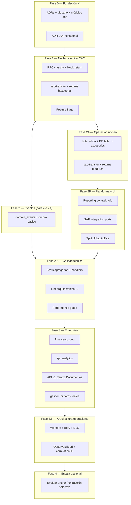
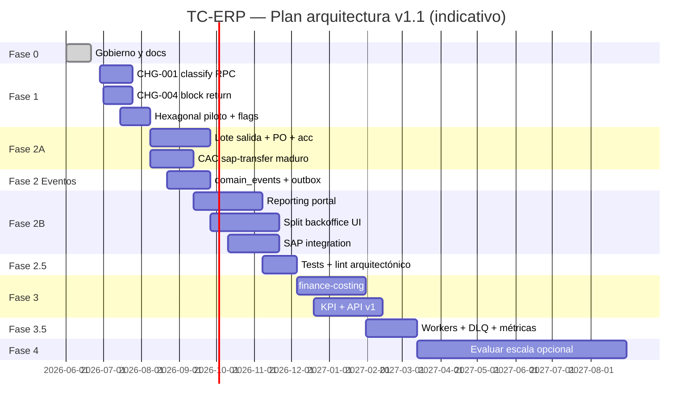

# Plan de arquitectura y entregables por fases — TC-ERP

**Versión:** 1.1 | **Fecha:** 2026-06-22  
**Estado:** **Revisado** — incorpora feedback de revisión arquitectónica (split Fase 2, calidad técnica, eventos adelantados, sin RabbitMQ por defecto).

**Regla rectora:** Operación CAC **no se detiene**. Strangler Fig + feature flags + mismas rutas URL en Fase 1–2.

**Cómo migrar (operativo):** [migration-playbook.md](migration-playbook.md) — reglas de oro, fases A–D, checklist de aprobación.

---

## 0. Principios reforzados (revisión v1.1)

### Secuencia sana (no el camino del dolor)

```
ERP actual
    ↓
Hexagonal + DDD (módulos)
    ↓
Domain Events + Outbox básico   ← la autopista
    ↓
Finance / KPI / BI / API        ← los camiones
    ↓
Workers + observabilidad
    ↓
Escala selectiva (solo si métricas lo exigen)
```

**Explícitamente NO es el roadmap:** ERP → Microservicios → Kafka → RabbitMQ → caos.

La decisión de **Monolito Modular** ([ADR-001](ADR-001-monolith-modular-evolution.md)) se mantiene. Microservicios y brokers de mensajes **no son prerequisito**; son evaluación tardía.

### Feature flags — mayor acierto operativo

| Flag | Ciclo de vida |
|------|----------------|
| `USE_HEXAGONAL_SAP_TRANSFER` | Legacy ON → pruebas → Nuevo ON → Legacy OFF |
| `USE_ATOMIC_CLASSIFY` | Idem |

Reduce riesgo de despliegue sin detener operación CAC.

### Fase 1 — prioridad correcta

Resolver **problemas de negocio antes que de arquitectura de infraestructura**:

- `classify_equipment_batch_tx` — inconsistencia cuesta dinero hoy
- `block_return_by_sap_transfer_tx` — rollback transaccional

No tener RabbitMQ **no cuesta dinero**; una clasificación inconsistente **sí**.

### Madurez arquitectónica objetivo

| Hito | Score orientativo |
|------|-------------------|
| Baseline actual | ~45/100 |
| Post Fase 1 | ~55/100 |
| Post Fase 2 (+ 2.5) | ~70/100 |
| Post Fase 3 (+ 3.5) | ~85/100 |

---

## 1. Visión en una página



| Fase | Duración estimada | Impacto operativo | Objetivo |
|------|-------------------|-------------------|----------|
| **0** | 2–3 sem | Ninguno | Gobierno, documentación, decisiones |
| **1** | 4–6 sem | Bajo | Transacciones atómicas CAC + piloto hexagonal + flags |
| **2A** | 4–6 sem | Ninguno* | Lote salida, PO, accesorios; CAC maduro |
| **2 (eventos)** | 3–4 sem | Bajo | `domain_events` + outbox básico (autopista) |
| **2B** | 4–6 sem | Ninguno* | Reporting, SAP integration, split UI |
| **2.5** | 3–4 sem | Ninguno | Tests, lint arquitectónico, observabilidad base |
| **3** | 8–12 sem | Bajo (noches) | Finanzas, KPI, API, BI — **sobre eventos** |
| **3.5** | 4–6 sem | Bajo | Workers, retry, DLQ, métricas operativas |
| **4** | 3–6 mes | Medio (solo si métricas) | Escala selectiva; **evaluar** broker, no obligatorio |

\*Mismas URLs; cambios detrás de flags.

> **Riesgo organizacional (v1.1):** La Fase 2 original concentraba ~40% del roadmap. Se divide en **2A / eventos / 2B** para evitar sobrecarga de un solo equipo.

---

## 2. Mapa de módulos por fase

| Módulo | Doc | Fase diseño | Fase código | Prioridad negocio |
|--------|-----|-------------|-------------|-------------------|
| **platform** (gobierno) | parcial | 0 ✓ | 0–1 | — |
| **sap-transfer** | ✓ completo | 0 ✓ | **1 → 2A** | P0 |
| **returns** | ✓ completo | 0 ✓ | **1 → 2A** | P0 |
| **platform-events** (outbox) | pendiente | 1 | **2 (eventos)** | P0 |
| **outbound-dispatch** | ✓ | 0 ✓ | **2A** | P1 |
| **production-order** | ✓ | 0 ✓ | **2A** | P1 |
| **accessories-dispatch** | ✓ | 0 ✓ | **2A** | P1 |
| **reporting** | ✓ completo | 0 ✓ | **2B** | P0 |
| **sap-integration** | pendiente | 0–1 | **2B** | P0 |
| **kpi-analytics** | pendiente | 1 | **3** | P0 |
| **finance-costing** | ✓ | 0 ✓ | **3** | P1 |
| **logistics-reception** | pendiente | 2 | 2A–3 | P2 |
| **production-classification** | pendiente | 2 | 2A–3 | P2 |
| **warehouse** | pendiente | 2 | 2A–3 | P2 |
| **workshop** | pendiente | 2 | 2A–3 | P2 |
| **rrhh-hrms** | parcial código | 2 | 2B–3 | P2 |
| **gestion-bi** | — | 3 | **3** | P3 |
| **traceability** | — | 3 | 3–3.5 | P3 |
| **platform-api** (ADR-003) | ✓ ADR | 0 ✓ | **3–4** | P1 |
| **platform-ops** (workers, DLQ) | pendiente | 2.5 | **3.5** | P1 |

---

## 3. Fase 0 — Fundación y gobierno

**Duración:** 2–3 semanas | **Estado:** ~90% completado

*(Sin cambios sustanciales respecto a v1.0 — ver secciones D0/C0 en historial git.)*

### Criterio de salida Fase 0

- [x] ADRs 001–004 aprobados
- [x] Piloto sap-transfer + returns documentado
- [x] Módulos negocio futuros documentados
- [x] CHG-001 redactado — [CHG-001](../changes/CHG-001-classify-atomic-rpc.md)
- [ ] Doc sap-integration + kpi-analytics (cierre documental)

---

## 4. Fase 1 — Núcleo atómico CAC

**Duración:** 4–6 semanas | **Impacto:** Bajo (misma UI; RPC detrás de flag)

### 4.1 Objetivo

Eliminar inconsistencias transaccionales en **clasificación batch** y **devolución bloque SAP**. Introducir **primer módulo hexagonal** con legacy bridge y **feature flags** como mecanismo de despliegue seguro.

### 4.2 Entregables

#### Base de datos

| ID | Entregable | CHG |
|----|------------|-----|
| DB1-01 | RPC `classify_equipment_batch_tx` atómica | CHG-001 |
| DB1-02 | RPC `block_return_by_sap_transfer_tx` | CHG-004 |
| DB1-03 | RPC `full_reception_return_tx` (si aplica) | CHG-005 |

#### Código hexagonal (sap-transfer + returns)

| ID | Entregable | CHG |
|----|------------|-----|
| C1-01 | `src/modules/sap-transfer/` domain + ports | CHG-003 inicio |
| C1-02 | `ClassifyEquipmentBatchHandler` + legacy bridge | CHG-003 |
| C1-03 | `src/modules/returns/` domain + ports | CHG-006 inicio |
| C1-04 | `BlockReturnBySapHandler` + RPC adapter | CHG-004 |
| C1-05 | Registro DI en `container.ts` | ADR-004 |
| C1-06 | Feature flags `USE_HEXAGONAL_SAP_TRANSFER`, `USE_ATOMIC_CLASSIFY` | — |

#### Operación / calidad

| ID | Entregable | Métrica éxito |
|----|------------|---------------|
| Q1-01 | 0 ingresos huérfanos en flujo nuevo | OS sin series post-classify |
| Q1-02 | Devolución bloque 100% transaccional | Rollback automático en error |
| Q1-03 | Paridad tests manuales CAC | Checklist plantilla impacto §9 |

### 4.3 Criterio de salida Fase 1

- [ ] RPC classify y block return en producción con flag
- [ ] Handlers hexagonal con tests unitarios domain (mínimo sap-transfer)
- [ ] Operaciones CAC aprueba paridad en staging
- [ ] Flag activado en horario bajo tráfico

**Madurez esperada al cierre:** ~55/100

---

## 5. Fase 2A — Operación núcleo (negocio primero)

**Duración:** 4–6 semanas | **Impacto:** Ninguno en URLs; flags por módulo

### 5.1 Objetivo

Implementar **capacidades de negocio nuevas** que operación exige: lote salida, PO taller, accesorios. Completar madurez **sap-transfer** y **returns** en hexagonal.

### 5.2 Entregables

#### Track CAC maduro

| ID | Entregable | CHG |
|----|------------|-----|
| C2A-01 | Sync estado `INGRESADO_BODEGA` sap ↔ warehouse | CHG-002 |
| C2A-02 | sap-transfer: retirar legacy bridge (flag 100%) | CHG-003 |
| C2A-03 | returns: `SapTransferReturnPort` desacoplado | CHG-006 |
| C2A-04 | Devolución individual actualiza OS | CHG-007 |

#### Track salidas, PO, accesorios (ADR-002)

| ID | Entregable | CHG |
|----|------------|-----|
| DB2A-01 | Tabla `dispatch_batches` + FKs dispatches/boxes | CHG-010 |
| C2A-10 | Módulo `outbound-dispatch` hexagonal | CHG-010, 011 |
| C2A-11 | UI lote salida en `/despacho` (caja + lote) | CHG-011 |
| DB2A-02 | Tabla `production_orders` + FK OS | CHG-040 |
| C2A-12 | Módulo `production-order` — solo Taller + bodega | CHG-040 |
| C2A-13 | UI PO en `/produccion/taller` | CHG-040 |
| C2A-14 | Accesorios OUT con/sin lote | CHG-030 |
| C2A-15 | Mismo `dispatch_batches` para equipos + accesorios | ADR-002 D4 |

### 5.3 Criterio de salida Fase 2A

- [ ] Despacho por caja amarrado a lote salida (opcional en UI)
- [ ] PO operativa en Taller para equipos en bodega
- [ ] Accesorios nuevo/recuperado con y sin lote
- [ ] sap-transfer + returns sin `lib/database` en flujo flag-on

---

## 6. Fase 2 — Eventos de dominio y outbox básico

**Duración:** 3–4 semanas | **Paralelo con 2A/2B** | **Adelantado desde Fase 3 (v1.1)**

### 6.1 Objetivo

Construir la **autopista** antes de Finance, KPI, BI y API. Sin eventos confiables, esos módulos dependen de `notes` y parsers frágiles.

> Regla: **Primero la autopista. Después los camiones.**

### 6.2 Entregables

| ID | Entregable |
|----|------------|
| D2E-01 | `docs/modules/platform-events/` — catálogo eventos v1 |
| DB2E-01 | Tabla `domain_events` + índices |
| DB2E-02 | Tabla `outbox_messages` (estado: pending / sent / failed) |
| DB2E-03 | RPC `emit_domain_event` transaccional con dual-write |
| C2E-01 | Emisor outbox en flujos críticos: classify, dispatch, return |
| C2E-02 | Dual-write: acciones críticas → events + notes (paralelo) |
| C2E-03 | Correlation ID en requests API y emisión eventos |
| C2E-04 | Publisher in-process (sin broker externo) para handlers locales |
| Q2E-01 | ≥30% acciones críticas en `domain_events` |

### 6.3 Criterio de salida

- [ ] Tabla `domain_events` en producción con dual-write en classify + PX/CAC
- [ ] Outbox básico: insert atómico con transacción de negocio
- [ ] Catálogo eventos v1 documentado
- [ ] **No requiere RabbitMQ** — publisher local o polling simple

---

## 7. Fase 2B — Plataforma, reportes e integración

**Duración:** 4–6 semanas | **Puede solaparse con cierre 2A**

### 7.1 Objetivo

Proyectos grandes **separados** del núcleo operativo: reporting, SAP archivo, refactor UI. Evita mezclar “lote salida” con “portal de 30 reportes” en el mismo sprint.

### 7.2 Entregables

#### Reporting

| ID | Entregable | CHG |
|----|------------|-----|
| DB2B-01 | `report_definitions`, `report_runs` | CHG-050 |
| C2B-01 | Módulo `reporting` hexagonal + XLSX/CSV exporters | CHG-051 |
| C2B-02 | Provider `CAC_CLASIFICACION_HISTORICO` | CHG-052 |
| C2B-03 | Portal `/reportes` | CHG-053 |
| C2B-04 | Backoffice export delega a reporting (flag) | CHG-052 |

#### SAP integración

| ID | Entregable |
|----|------------|
| D2B-01 | `docs/modules/sap-integration/` completo |
| C2B-10 | Ports lectura validación SAP para despacho gate |
| C2B-11 | Provider reportes `SAP_DIFERENCIAS`, `SAP_NO_VALIDADOS` |

#### Split UI backoffice

| ID | Entregable |
|----|------------|
| C2B-20 | Backoffice: hooks + subcomponentes ≤300 líneas |
| C2B-21 | `backoffice/page.tsx` contenedor <300 líneas |

### 7.3 Criterio de salida Fase 2B

- [ ] Portal `/reportes` con ≥5 reportes migrados
- [ ] Backoffice <300 líneas contenedor
- [ ] sap-integration documentado + ports en despacho

---

## 8. Fase 2.5 — Calidad técnica

**Duración:** 3–4 semanas | **Gate obligatorio antes de Fase 3**

### 8.1 Objetivo

Evitar la **bomba de tiempo** actual: cero `*.test.ts`, 25+ páginas importando `lib/database` directamente. Sin esto, Fase 3 (finanzas, KPI) multiplica deuda.

### 8.2 Entregables

#### Testing (obligatorio antes de F3)

| ID | Entregable |
|----|------------|
| Q2.5-01 | Tests unitarios: `OrdenServicioAggregate` (recepción) |
| Q2.5-02 | Tests unitarios: `InventarioAggregate` |
| Q2.5-03 | Tests unitarios: `DespachoAggregate` |
| Q2.5-04 | Tests handlers: `ClassifyEquipmentBatchHandler` |
| Q2.5-05 | CI ejecuta suite en cada PR |

#### Lint arquitectónico (CI falla si se viola)

| Regla | Descripción |
|-------|-------------|
| **ARCH-01** | `src/app/**` (UI) **NO** puede importar `@/lib/database` |
| **ARCH-02** | `src/modules/*/domain/**` **NO** puede importar Supabase client |
| **ARCH-03** | Nuevos CHG en Fase 3+ deben vivir bajo `src/modules/` |

Implementación sugerida: regla ESLint `no-restricted-imports` o script `scripts/check-architecture.js` en CI.

#### Observabilidad base

| ID | Entregable |
|----|------------|
| Q2.5-10 | Request ID + Correlation ID en middleware API |
| Q2.5-11 | Logging estructurado (módulo, acción, duration_ms) |
| Q2.5-12 | Health check `/api/health` |

#### Performance

| ID | Entregable |
|----|------------|
| Q2.5-20 | Baseline latencia: classify, list bandeja, historial CAC |
| Q2.5-21 | Alertas si p95 API > umbral acordado |

### 8.3 Criterio de salida Fase 2.5

- [ ] ≥4 suites de tests agregados/handlers en CI verde
- [ ] Lint arquitectónico activo; 0 violaciones nuevas en PR
- [ ] Correlation ID en flujos classify + historial
- [ ] Baseline performance documentado

**Madurez esperada al cierre Fase 2 + 2.5:** ~70/100

---

## 9. Fase 3 — Enterprise: finanzas, KPI, API, BI

**Duración:** 8–12 semanas | **Impacto:** Bajo (backfill nocturno)

### 9.1 Objetivo

Activar **finanzas por equipo despachado**, **KPI estructurado**, **API v1** y **BI con datos reales** — todos **consumiendo `domain_events`**, no parsers de `notes`.

### 9.2 Entregables

#### Datos (consumo de eventos — no crear autopista aquí)

| ID | Entregable |
|----|------------|
| C3-01 | Backfill histórico notes → events (job nocturno) |
| C3-02 | Deprecar parsers notes en KPI (lectura events) |
| Q3-01 | ≥80% acciones críticas en `domain_events` |

#### finance-costing (ADR-002 D3)

| ID | Entregable | CHG |
|----|------------|-----|
| DB3-01 | `cost_ledger_entries`, `material_purchases`, allocations | CHG-020 |
| C3-10 | Módulo `finance-costing` hexagonal | CHG-020 |
| C3-11 | Listener `equipment.dispatched` → `DESPACHO_UNIT` | CHG-021 |
| C3-12 | Reportes `FIN_COSTO_VS_DESPACHO`, etc. | CHG-056 |
| C3-13 | Refactor `/gestion/costos` lee ledger | CHG-020 |

#### kpi-analytics

| ID | Entregable |
|----|------------|
| D3-01 | `docs/modules/kpi-analytics/` |
| DB3-02 | Proyección `kpi_daily_worker_stats` |
| C3-20 | Motor KPI desde `domain_events` |
| C3-21 | Integración metas `taller_kpi_goals` |

#### API Centro Documentos (ADR-003)

| ID | Entregable | CHG |
|----|------------|-----|
| C3-30 | `/api/v1/reports/{code}/export` | CHG-055 |
| C3-31 | `/api/v1/dispatch-batches` CRUD lectura | ADR-003 |
| C3-32 | `/api/v1/production-orders` | CHG-041 |
| C3-33 | Webhooks: `equipment.dispatched`, `dispatch_batch.closed` | ADR-003 |
| C3-34 | Auth API keys + rate limit | platform |

#### gestion-bi

| ID | Entregable |
|----|------------|
| C3-40 | Reemplazar mocks en `/gestion/bi` |
| C3-41 | Consume kpi-analytics + reporting |

### 9.3 Criterio de salida Fase 3

- [ ] Pago operativo registrado por equipo despachado (ledger)
- [ ] KPI productividad sin parsear `notes` en flujo nuevo
- [ ] API v1 documentada y 3 recursos mínimos en producción
- [ ] BI dashboard con datos reales
- [ ] ≥80% acciones críticas en `domain_events`

---

## 10. Fase 3.5 — Arquitectura operacional

**Duración:** 4–6 semanas | **Nueva en v1.1**

### 10.1 Objetivo

Madurar la infraestructura de eventos: de outbox básico a **procesamiento confiable** con observabilidad de negocio. Sigue sin imponer RabbitMQ.

### 10.2 Entregables

| ID | Entregable |
|----|------------|
| C3.5-01 | Worker outbox: poll `outbox_messages` → dispatch handlers |
| C3.5-02 | Retry policy (exponential backoff, max attempts) |
| C3.5-03 | Dead Letter Queue (tabla `outbox_dead_letters` + UI ops) |
| C3.5-04 | Reportes async pesados vía worker (sin extraer microservicio) |
| **Observabilidad** | |
| C3.5-10 | Métricas: tiempo promedio clasificación, despacho, errores/módulo |
| C3.5-11 | Métricas: eventos procesados, latencia API p50/p95 |
| C3.5-12 | Audit trail unificado (correlation ID end-to-end) |
| C3.5-13 | Dashboard ops interno o export a herramienta externa |

### 10.3 Criterio de salida Fase 3.5

- [ ] Outbox procesado por worker con retry + DLQ
- [ ] 0 eventos stuck >24h sin alerta
- [ ] Métricas de negocio publicadas
- [ ] Runbook incidentes outbox/DLQ

**Madurez esperada al cierre Fase 3 + 3.5:** ~85/100

---

## 11. Fase 4 — Escala opcional (sin RabbitMQ por defecto)

**Duración:** 3–6 meses | **Solo si métricas lo justifican**

### 11.1 Objetivo

Escalar horizontalmente **solo donde el volumen lo exija**. Hoy: 1 app, 1 DB, 1 deploy — **no hay problema que RabbitMQ resuelva**.

### 11.2 Secuencia de evaluación (no saltar pasos)

```
1. Outbox + Workers (Fase 3.5)     ← debe estar maduro
2. Métricas de cuello de botella
3. ¿Cola externa necesaria?         ← go/no-go documentado
4. Solo entonces: evaluar RabbitMQ / SQS / equivalente
5. Extracción microservicio         ← último recurso
```

### 11.3 Candidatos extracción (si métricas lo exigen)

| Candidato | Condición | Alternativa monolito primero |
|-----------|-----------|------------------------------|
| Reportes masivos | >50k filas frecuentes | Worker async Fase 3.5 |
| SAP archivos | >X MB/hora | Worker batch en mismo deploy |
| Consultas BI pesadas | Latencia lectura | Read replica PostgreSQL |

**No extraer:** backoffice, warehouse, workshop (transacciones fuertes).

### 11.4 Criterio de salida Fase 4

- [ ] Decisión go/no-go **documentada** por módulo con métricas reales
- [ ] Si broker: ADR dedicado con justificación vs outbox+worker
- [ ] Contratos eventos versionados
- [ ] Runbooks operación multi-deploy (solo si aplica)

---

## 12. Matriz CHG → Fase (consolidada v1.1)

| CHG | Título | Fase |
|-----|--------|------|
| CHG-001 | RPC classify_equipment_batch_tx | **1** |
| CHG-004 | RPC block_return_by_sap_transfer_tx | **1** |
| CHG-005 | RPC full_reception_return_tx | **1** |
| CHG-002 | Sync INGRESADO_BODEGA | **2A** |
| CHG-003 | Módulo sap-transfer completo | **2A** |
| CHG-006 | SapTransferReturnPort | **2A** |
| CHG-007 | OS update devolución individual | **2A** |
| CHG-010 | dispatch_batches | **2A** |
| CHG-011 | UI lote salida | **2A** |
| CHG-030 | Accesorios con/sin lote | **2A** |
| CHG-040 | production_orders | **2A** |
| CHG-060 | domain_events + outbox básico | **2 (eventos)** |
| CHG-050–053 | Reporting core + portal | **2B** |
| CHG-054 | Migrar exports restantes | **2B–3** |
| — | Tests agregados + lint CI | **2.5** |
| CHG-020–021 | finance-costing | **3** |
| CHG-041 | API PO | **3** |
| CHG-055–056 | API reports + finanzas | **3** |
| — | Workers + DLQ + observabilidad | **3.5** |
| — | Evaluar broker / microservicios | **4** (opcional) |

---

## 13. Cronograma indicativo



*Fechas orientativas; ajustar según capacidad del equipo.*

---

## 14. Métricas de éxito globales

| Métrica | Baseline | F1 | F2+2.5 | F3+3.5 |
|---------|----------|----|----|-----|
| Madurez arquitectónica (orientativa) | ~45 | ~55 | ~70 | ~85 |
| OS huérfanas post-classify | >0 | 0 | 0 | 0 |
| `backoffice/page.tsx` líneas | ~4400 | ~4000 | <300 contenedor | <300 |
| Reportes en UI dispersa | 100% | 100% | <40% | <10% |
| Acciones vía `domain_events` | 0% | 5% | **30%** | **80%** |
| Tests agregados en CI | 0 | 1+ | **4+** | 8+ |
| UI importa `lib/database` | 25+ | 25+ | **0 nuevos** | 0 |
| Pago por equipo en ledger | No | No | No | Sí |
| API Centro Documentos | No | No | No | v1 mínima |
| Outbox con worker + DLQ | No | No | básico | maduro |

---

## 15. Riesgos y mitigación

| Riesgo | Fase | Mitigación |
|--------|------|------------|
| Detener operación CAC | Todas | Strangler + flags + rollback por CHG |
| **Sobrecarga Fase 2 (organizacional)** | 2A/2B | Split 2A vs 2B; no un solo equipo en todo |
| Scope creep PO / lote | 2A | PO solo Taller; lote opcional accesorios |
| **Cero tests antes de finanzas** | 2.5 | Gate obligatorio Fase 2.5 antes de F3 |
| **UI acoplada a lib/database** | 2.5 | Lint ARCH-01 en CI |
| Notes históricos ilegibles | 3 | Dual-write desde Fase 2 eventos; backfill F3 |
| BI antes de eventos | 3 | Eventos en Fase 2; BI al final F3 |
| RabbitMQ prematuro | 4 | Outbox+worker primero; broker solo con ADR |
| Dos patrones código | 1–2 | ADR-004 + review checklist + lint |
| Microservicios prematuros | 4 | Gate métricas; default = monolito |

---

## 16. Próximos pasos inmediatos

| # | Acción | Responsable | Plazo |
|---|--------|-------------|-------|
| 1 | ~~Aprobar plan maestro v1.0~~ | PO + Tech Lead | ✓ 2026-06-18 |
| 2 | **Aprobar revisión v1.1** (split F2, eventos, calidad) | PO + Tech Lead | Pendiente |
| 3 | Aplicar migración 030+031 + paridad Fase 1 staging | Dev + Ops | En curso |
| 4 | Activar flags atómicos en producción (fuera de pico) | Ops CAC | Post-paridad |
| 5 | CHG-003 sap-transfer hexagonal completo | Dev | Fase 1 cierre |
| 6 | Redactar `docs/modules/platform-events/` | Tech | Inicio Fase 2 eventos |
| 7 | Prototipo lint ARCH-01 (`no-restricted-imports`) | Dev | Fase 2.5 prep |

---

## 17. Referencias

| Tema | Documento |
|------|-----------|
| Índice general | [docs/README.md](../README.md) |
| Ecosistema completo | [ecosystem-map.md](ecosystem-map.md) |
| Hexagonal | [ADR-004](ADR-004-hexagonal-architecture.md) |
| Monolito modular | [ADR-001](ADR-001-monolith-modular-evolution.md) |
| Guía de migración | [migration-playbook.md](migration-playbook.md) |
| Negocio PO/Lote/Finanzas | [ADR-002](ADR-002-production-order-and-lote.md) |
| API externa | [ADR-003](ADR-003-api-document-center.md) |
| Catálogo reportes | [report-catalog.md](../modules/reporting/report-catalog.md) |

---

**Última actualización:** 2026-06-22 (v1.1 — revisión arquitectónica)
