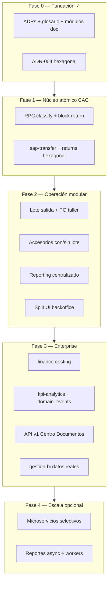
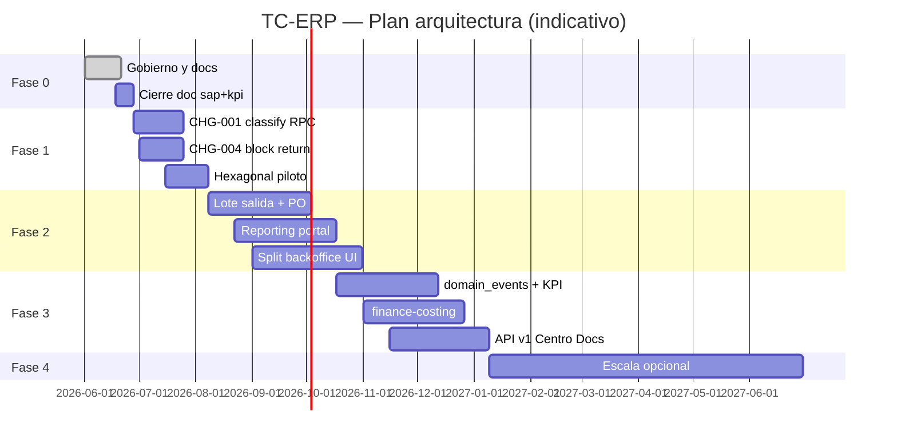

# Plan de arquitectura y entregables por fases — TC-ERP

**Versión:** 1.0 | **Fecha:** 2026-06-18  
**Estado:** **Aprobado por negocio** — 2026-06-18. Consolida ADR-001 a ADR-004 y todos los módulos acordados.

**Regla rectora:** Operación CAC **no se detiene**. Strangler Fig + feature flags + mismas rutas URL en Fase 1–2.

---

## 1. Visión en una página



| Fase | Duración estimada | Impacto operativo | Objetivo |
|------|-------------------|-------------------|----------|
| **0** | 2–3 sem | Ninguno | Gobierno, documentación, decisiones |
| **1** | 4–6 sem | Bajo | Transacciones atómicas CAC + piloto hexagonal |
| **2** | 6–10 sem | Ninguno* | Módulos nuevos (lote, PO, reportes) + split UI |
| **3** | 8–12 sem | Bajo (noches) | Finanzas, KPI estructurado, API, timeline |
| **4** | 3–6 mes | Medio (solo extraídos) | Escala horizontal opcional |

\*Mismas URLs; cambios detrás de flags.

---

## 2. Mapa de módulos por fase

| Módulo | Doc | Fase diseño | Fase código | Prioridad negocio |
|--------|-----|-------------|-------------|-------------------|
| **platform** (gobierno) | parcial | 0 ✓ | 0–1 | — |
| **sap-transfer** | ✓ completo | 0 ✓ | **1–2** | P0 |
| **returns** | ✓ completo | 0 ✓ | **1–2** | P0 |
| **sap-integration** | pendiente | 0–1 | **2** | P0 |
| **reporting** | ✓ completo | 0 ✓ | **2** | P0 |
| **outbound-dispatch** | ✓ | 0 ✓ | **2** | P1 |
| **production-order** | ✓ | 0 ✓ | **2** | P1 |
| **accessories-dispatch** | ✓ | 0 ✓ | **2** | P1 |
| **kpi-analytics** | pendiente | 1 | **3** | P0 |
| **finance-costing** | ✓ | 0 ✓ | **3** | P1 |
| **logistics-reception** | pendiente | 2 | 2–3 | P2 |
| **production-classification** | pendiente | 2 | 2–3 | P2 |
| **warehouse** | pendiente | 2 | 2–3 | P2 |
| **workshop** | pendiente | 2 | 2–3 | P2 |
| **rrhh-hrms** | parcial código | 2 | 2–3 | P2 |
| **gestion-bi** | — | 3 | **3** | P3 |
| **traceability** | — | 3 | 3 | P3 |
| **platform-api** (ADR-003) | ✓ ADR | 0 ✓ | **3–4** | P1 |

---

## 3. Fase 0 — Fundación y gobierno

**Duración:** 2–3 semanas | **Estado:** ~90% completado

### 3.1 Objetivo

Establecer **lenguaje común**, decisiones arquitectónicas y documentación por módulo **antes de código nuevo**.

### 3.2 Entregables documentación

| # | Entregable | Estado | Referencia |
|---|------------|--------|------------|
| D0-01 | ADR monolito modular | ✓ | [ADR-001](ADR-001-monolith-modular-evolution.md) |
| D0-02 | ADR PO / Lote / Finanzas / Accesorios | ✓ | [ADR-002](ADR-002-production-order-and-lote.md) |
| D0-03 | ADR API Centro Documentos | ✓ | [ADR-003](ADR-003-api-document-center.md) |
| D0-04 | ADR Hexagonal | ✓ | [ADR-004](ADR-004-hexagonal-architecture.md) |
| D0-05 | Layout hexagonal + checklist PR | ✓ | [hexagonal-layout.md](hexagonal-layout.md) |
| D0-06 | Ecosystem map completo | ✓ | [ecosystem-map.md](ecosystem-map.md) |
| D0-07 | Glosario + catálogo estados | ✓ | [glossary.md](glossary.md), [entity-status-catalog.md](entity-status-catalog.md) |
| D0-08 | Plantilla impacto CHG | ✓ | [impact-change-template.md](impact-change-template.md) |
| D0-09 | Módulo sap-transfer (7 docs) | ✓ | [modules/sap-transfer/](../modules/sap-transfer/README.md) |
| D0-10 | Módulo returns (7 docs) | ✓ | [modules/returns/](../modules/returns/README.md) |
| D0-11 | Módulos negocio aprobados (PO, lote, finanzas, accesorios) | ✓ | [modules/](../modules/) |
| D0-12 | Módulo reporting + catálogo 30+ reportes | ✓ | [modules/reporting/](../modules/reporting/README.md) |
| D0-13 | **Este plan maestro por fases** | ✓ | Este documento |
| D0-14 | Doc sap-integration | ☐ | Fase 0 cierre |
| D0-15 | Doc kpi-analytics | ☐ | Fase 0 cierre |

### 3.3 Entregables código (ya en producción / hotfixes)

| # | Entregable | Estado |
|---|------------|--------|
| C0-01 | Migración `series.notes` (028) | ✓ |
| C0-02 | Retry fetch + devolución bloque batch | ✓ |
| C0-03 | Bandeja backoffice: error banner + retry | ✓ |
| C0-04 | SAP obligatorio para Agregar manifiesto | ✓ |

### 3.4 Criterio de salida Fase 0

- [x] ADRs 001–004 aprobados
- [x] Piloto sap-transfer + returns documentado
- [x] Módulos negocio futuros documentados
- [x] CHG-001 redactado — [CHG-001](../changes/CHG-001-classify-atomic-rpc.md)
- [ ] Doc sap-integration + kpi-analytics (cierre documental)

---

## 4. Fase 1 — Núcleo atómico CAC

**Duración:** 4–6 semanas | **Impacto:** Bajo (misma UI; RPC detrás de flag)

### 4.1 Objetivo

Eliminar inconsistencias transaccionales en **clasificación batch** y **devolución bloque SAP**. Introducir **primer módulo hexagonal** con legacy bridge.

### 4.2 Entregables

#### Documentación

| ID | Entregable |
|----|------------|
| D1-01 | `docs/changes/CHG-001-classify-atomic-rpc.md` |
| D1-02 | `docs/changes/CHG-004-block-return-rpc.md` |
| D1-03 | `docs/changes/CHG-005-full-reception-return-rpc.md` |

#### Base de datos

| ID | Entregable | CHG |
|----|------------|-----|
| DB1-01 | RPC `classify_equipment_batch_tx` atómica | CHG-001 |
| DB1-02 | RPC `block_return_by_sap_transfer_tx` | CHG-004 |
| DB1-03 | RPC `full_reception_return_tx` (si aplica) | CHG-005 |

#### Código hexagonal (sap-transfer + returns)

| ID | Entregable | CHG |
|----|------------|-----|
| C1-01 | `src/modules/sap-transfer/` domain + ports | CHG-003 inicio |
| C1-02 | `ClassifyEquipmentBatchHandler` + legacy bridge | CHG-003 |
| C1-03 | `src/modules/returns/` domain + ports | CHG-006 inicio |
| C1-04 | `BlockReturnBySapHandler` + RPC adapter | CHG-004 |
| C1-05 | Registro DI en `container.ts` | ADR-004 |
| C1-06 | Feature flags `USE_HEXAGONAL_SAP_TRANSFER`, `USE_ATOMIC_CLASSIFY` | — |

#### Operación / calidad

| ID | Entregable | Métrica éxito |
|----|------------|---------------|
| Q1-01 | 0 ingresos huérfanos en flujo nuevo | OS sin series post-classify |
| Q1-02 | Devolución bloque 100% transaccional | Rollback automático en error |
| Q1-03 | Paridad tests manuales CAC | Checklist plantilla impacto §9 |

### 4.3 Criterio de salida Fase 1

- [ ] RPC classify y block return en producción con flag
- [ ] Handlers hexagonal con tests unitarios domain
- [ ] Operaciones CAC aprueba paridad en staging
- [ ] Flag activado en horario bajo tráfico

### 4.4 Dependencias

```
CHG-001 (classify RPC) ──┐
                         ├──► CHG-003 (módulo sap-transfer)
CHG-004 (block return) ──┼──► CHG-006 (port returns ↔ sap-transfer)
CHG-005 (full return)  ──┘
```

---

## 5. Fase 2 — Operación modular

**Duración:** 6–10 semanas | **Impacto:** Ninguno en URLs; flags por módulo

### 5.1 Objetivo

Implementar **capacidades de negocio nuevas** (lote salida, PO taller, accesorios) en hexagonal puro. Centralizar **reportes**. Dividir UI monolítica. Formalizar sap-integration.

### 5.2 Tracks paralelos

```mermaid
flowchart LR
    subgraph T1["Track 1 — CAC maduro"]
        ST[sap-transfer completo]
        RT[returns completo]
        BO[split backoffice UI]
    end

    subgraph T2["Track 2 — Salidas y taller"]
        DB[dispatch_batches]
        PO[production_orders]
        AC[accessories OUT]
    end

    subgraph T3["Track 3 — Reportes"]
        RP[reporting module]
        PORT[/reportes]
    end

    subgraph T4["Track 4 — SAP archivo"]
        SI[sap-integration doc + ports]
    end

    T1 --- T2
    T2 --> T3
    T4 --> T2
```

### 5.3 Entregables por track

#### Track 1 — CAC maduro

| ID | Entregable | CHG |
|----|------------|-----|
| C2-01 | Sync estado `INGRESADO_BODEGA` sap ↔ warehouse | CHG-002 |
| C2-02 | sap-transfer: retirar legacy bridge (flag 100%) | CHG-003 |
| C2-03 | returns: `SapTransferReturnPort` desacoplado | CHG-006 |
| C2-04 | Devolución individual actualiza OS | CHG-007 |
| C2-05 | Backoffice: hooks + subcomponentes ≤300 líneas | — |
| C2-06 | `backoffice/page.tsx` contenedor <300 líneas | ADR-001 métrica |

#### Track 2 — Salidas, PO, accesorios (ADR-002)

| ID | Entregable | CHG |
|----|------------|-----|
| DB2-01 | Tabla `dispatch_batches` + FKs dispatches/boxes | CHG-010 |
| C2-10 | Módulo `outbound-dispatch` hexagonal | CHG-010, 011 |
| C2-11 | UI lote salida en `/despacho` (caja + lote) | CHG-011 |
| DB2-02 | Tabla `production_orders` + FK OS | CHG-040 |
| C2-12 | Módulo `production-order` — solo Taller + bodega | CHG-040 |
| C2-13 | UI PO en `/produccion/taller` | CHG-040 |
| C2-14 | Accesorios OUT con/sin lote | CHG-030 |
| C2-15 | Mismo `dispatch_batches` para equipos + accesorios | ADR-002 D4 |

#### Track 3 — Reporting

| ID | Entregable | CHG |
|----|------------|-----|
| DB2-03 | `report_definitions`, `report_runs` | CHG-050 |
| C2-20 | Módulo `reporting` hexagonal + XLSX/CSV exporters | CHG-051 |
| C2-21 | Provider `CAC_CLASIFICACION_HISTORICO` | CHG-052 |
| C2-22 | Portal `/reportes` | CHG-053 |
| C2-23 | Backoffice export delega a reporting (flag) | CHG-052 |
| C2-24 | Migrar despacho + recepción + inventario exports | CHG-054 |

#### Track 4 — SAP integración

| ID | Entregable |
|----|------------|
| D2-01 | `docs/modules/sap-integration/` completo |
| C2-30 | Ports lectura validación SAP para despacho gate |
| C2-31 | Provider reportes `SAP_DIFERENCIAS`, `SAP_NO_VALIDADOS` |

### 5.4 Criterio de salida Fase 2

- [ ] Despacho por caja amarrado a lote salida (opcional en UI)
- [ ] PO operativa en Taller para equipos en bodega
- [ ] Accesorios nuevo/recuperado con y sin lote
- [ ] Portal `/reportes` con ≥5 reportes migrados
- [ ] Backoffice <300 líneas contenedor
- [ ] sap-transfer + returns sin `lib/database` en flujo flag-on

---

## 6. Fase 3 — Enterprise: datos, finanzas, API

**Duración:** 8–12 semanas | **Impacto:** Bajo (backfill nocturno)

### 6.1 Objetivo

Dejar de depender de `receptions.notes` para KPI y trazabilidad. Activar **finanzas por equipo despachado**. Exponer **API v1** hacia Centro de Documentos. BI con datos reales.

### 6.2 Entregables

#### Datos estructurados (timeline)

| ID | Entregable |
|----|------------|
| DB3-01 | Tabla `domain_events` |
| DB3-02 | Dual-write: acciones críticas → events + notes (paralelo) |
| DB3-03 | Backfill histórico notes → events (job nocturno) |
| C3-01 | Deprecar parsers notes en KPI (lectura events) |

#### finance-costing (ADR-002 D3)

| ID | Entregable | CHG |
|----|------------|-----|
| DB3-04 | `cost_ledger_entries`, `material_purchases`, allocations | CHG-020 |
| C3-10 | Módulo `finance-costing` hexagonal | CHG-020 |
| C3-11 | Listener `equipment.dispatched` → `DESPACHO_UNIT` | CHG-021 |
| C3-12 | Reportes `FIN_COSTO_VS_DESPACHO`, etc. | CHG-056 |
| C3-13 | Refactor `/gestion/costos` lee ledger | CHG-020 |

#### kpi-analytics

| ID | Entregable |
|----|------------|
| D3-01 | `docs/modules/kpi-analytics/` |
| DB3-05 | Proyección `kpi_daily_worker_stats` |
| C3-20 | Motor KPI desde `domain_events` |
| C3-21 | Integración metas `taller_kpi_goals` |

#### API Centro Documentos (ADR-003)

| ID | Entregable | CHG |
|----|------------|-----|
| C3-30 | `/api/v1/reports/{code}/export` | CHG-055 |
| C3-31 | `/api/v1/dispatch-batches` CRUD lectura | ADR-003 |
| C3-32 | `/api/v1/production-orders` | CHG-041 |
| C3-33 | Webhooks: `equipment.dispatched`, `dispatch_batch.closed` | ADR-003 |
| C3-34 | Auth API keys + rate limit | platform |

#### gestion-bi

| ID | Entregable |
|----|------------|
| C3-40 | Reemplazar mocks en `/gestion/bi` |
| C3-41 | Consume kpi-analytics + reporting |

#### RRHH (consolidación)

| ID | Entregable |
|----|------------|
| C3-50 | Migrar `ReportesTab` → reporting module |
| D3-02 | `docs/modules/rrhh-hrms/` |

### 6.3 Criterio de salida Fase 3

- [ ] Pago operativo registrado por equipo despachado (ledger)
- [ ] KPI productividad sin parsear `notes` en flujo nuevo
- [ ] API v1 documentada y 3 recursos mínimos en producción
- [ ] BI dashboard con datos reales
- [ ] ≥80% acciones críticas en `domain_events`

---

## 7. Fase 4 — Escala opcional

**Duración:** 3–6 meses | **Impacto:** Medio solo en módulos extraídos

### 7.1 Objetivo

Escalar horizontalmente **solo donde el volumen lo exija**. No obligatorio para operación CAC.

### 7.2 Candidatos extracción

| Servicio | Condición extracción | Puerto entrada |
|----------|---------------------|----------------|
| `sap-integration` | Archivos SAP > X MB / hora | API + worker |
| `reporting` | Reportes >50k filas frecuentes | Job queue async |
| `traceability` | Consultas pesadas BI | Read replica |

**No extraer:** backoffice, warehouse, workshop (transacciones fuertes).

### 7.3 Entregables

| ID | Entregable |
|----|------------|
| C4-01 | `GenerateReportAsync` + worker |
| C4-02 | sap-integration servicio batch (si métrica lo exige) |
| C4-03 | API v1 completa Centro Documentos |
| C4-04 | Read replicas / caching consultas |

### 7.4 Criterio de salida Fase 4

- Decisión go/no-go por módulo con métricas reales
- Contratos eventos versionados
- Runbooks operación multi-deploy

---

## 8. Matriz CHG → Fase (consolidada)

| CHG | Título | Fase |
|-----|--------|------|
| CHG-001 | RPC classify_equipment_batch_tx | **1** |
| CHG-004 | RPC block_return_by_sap_transfer_tx | **1** |
| CHG-005 | RPC full_reception_return_tx | **1** |
| CHG-002 | Sync INGRESADO_BODEGA | **2** |
| CHG-003 | Módulo sap-transfer completo | **2** |
| CHG-006 | SapTransferReturnPort | **2** |
| CHG-007 | OS update devolución individual | **2** |
| CHG-010 | dispatch_batches | **2** |
| CHG-011 | UI lote salida | **2** |
| CHG-030 | Accesorios con/sin lote | **2** |
| CHG-040 | production_orders | **2** |
| CHG-050–053 | Reporting core + portal | **2** |
| CHG-054 | Migrar exports restantes | **2–3** |
| CHG-020–021 | finance-costing | **3** |
| CHG-041 | API PO | **3** |
| CHG-055–056 | API reports + finanzas | **3** |
| CHG-060+ | domain_events, kpi (reservar) | **3** |

---

## 9. Cronograma indicativo



*Fechas orientativas; ajustar según capacidad del equipo.*

---

## 10. Métricas de éxito globales

| Métrica | Baseline | F1 | F2 | F3 |
|---------|----------|----|----|-----|
| OS huérfanas post-classify | >0 | 0 | 0 | 0 |
| `backoffice/page.tsx` líneas | ~4400 | ~4000 | <300 contenedor | <300 |
| Reportes en UI dispersa | 100% | 100% | <40% | <10% |
| Acciones vía `domain_events` | 0% | 5% | 30% | 80% |
| Pago por equipo en ledger | No | No | No | Sí |
| API Centro Documentos | No | No | No | v1 mínima |

---

## 11. Riesgos y mitigación

| Riesgo | Fase | Mitigación |
|--------|------|------------|
| Detener operación CAC | Todas | Strangler + flags + rollback por CHG |
| Scope creep Fase 2 | 2 | PO solo Taller; lote opcional accesorios |
| Notes históricos ilegibles | 3 | Dual-write; no borrar notes hasta backfill OK |
| Dos patrones código | 1–2 | ADR-004 + review checklist |
| BI antes de KPI estructurado | 3 | gestion-bi al final Fase 3 |
| Microservicios prematuros | 4 | Gate métricas; default = monolito |

---

## 12. Próximos pasos inmediatos

| # | Acción | Responsable | Plazo |
|---|--------|-------------|-------|
| 1 | ~~Aprobar este plan maestro~~ | PO + Tech Lead | ✓ 2026-06-18 |
| 2 | ~~Redactar CHG-001~~ | Tech | ✓ |
| 3 | ~~**Implementar CHG-001** (RPC + flag)~~ | Dev | ✓ |
| 4 | Aplicar migración 030 + paridad CHG-004 staging | Dev + Ops CAC | En curso |
| 5 | Activar flags atómicos en producción (fuera de pico) | Ops CAC | Post-paridad |
| 6 | ~~CHG-005 full_reception_return_tx~~ | Dev | ✓ |
| 7 | Aplicar 030+031 + paridad Fase 1 staging | Dev + Ops | En curso |
| 8 | CHG-003 módulo hexagonal sap-transfer | Dev | Siguiente |

---

## 13. Referencias

| Tema | Documento |
|------|-----------|
| Índice general | [docs/README.md](../README.md) |
| Ecosistema completo | [ecosystem-map.md](ecosystem-map.md) |
| Hexagonal | [ADR-004](ADR-004-hexagonal-architecture.md) |
| Negocio PO/Lote/Finanzas | [ADR-002](ADR-002-production-order-and-lote.md) |
| API externa | [ADR-003](ADR-003-api-document-center.md) |
| Catálogo reportes | [report-catalog.md](../modules/reporting/report-catalog.md) |

---

**Última actualización:** 2026-06-18
