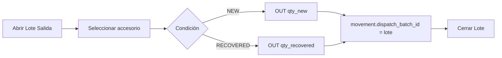
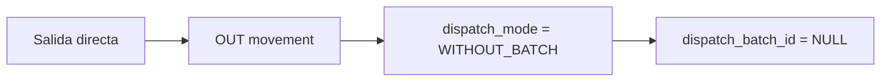

# Módulo: accessories-dispatch

| Campo | Valor |
|-------|-------|
| **Bounded context** | `accessories` (subdominio despacho) |
| **Estado doc** | Aprobado negocio |
| **ADR** | ADR-002 D4 |
| **Legacy** | `accessories`, `accessory_movements`, `accessory_boxes` |

---

## Propósito

Gestionar despacho de **accesorios Nuevo y Recuperado**, con dos modalidades:

1. **Con Lote de Salida** — agrupado para consulta, finanzas y Centro de Documentos
2. **Sin Lote** — salida directa (urgente, ajuste, mostrador)

---

## Stock existente

| Campo | Tabla `accessories` |
|-------|---------------------|
| Nuevo | `qty_new` |
| Recuperado | `qty_recovered` |

Movimientos: `accessory_movements` con `condition`: `NEW` | `RECOVERED`.

---

## Extensiones propuestas

### `accessory_movements` (columnas nuevas)

| Columna | Tipo | Descripción |
|---------|------|-------------|
| `dispatch_batch_id` | UUID NULL | FK → `dispatch_batches` si con lote |
| `dispatch_mode` | TEXT | `WITH_BATCH` \| `WITHOUT_BATCH` |
| `destination` | TEXT | Ya existe parcialmente |
| `service_order_id` | UUID NULL | Si accesorio va ligado a equipo |

### Tabla puente `dispatch_batch_accessory_lines` (opcional)

Si un lote mezcla equipos (cajas) y accesorios:

| Campo | Tipo |
|-------|------|
| `dispatch_batch_id` | UUID |
| `accessory_movement_id` | UUID |
| `quantity` | INT |
| `condition` | NEW / RECOVERED |

---

## Flujos

### A — Despacho con Lote de Salida

### B — Despacho sin Lote

---

## Reglas de negocio

| ID | Regla |
|----|-------|
| R-AC-01 | `condition` obligatorio: NEW o RECOVERED |
| R-AC-02 | No OUT si stock insuficiente (`qty_new` / `qty_recovered`) |
| R-AC-03 | Con lote: `dispatch_batch_id` requerido antes de confirmar |
| R-AC-04 | Sin lote: `dispatch_batch_id` debe ser NULL |
| R-AC-05 | Mismo `dispatch_batches` puede incluir cajas equipos + líneas accesorios |
| R-AC-06 | Finanzas: cada OUT genera `ACCESORIO_SALIDA` en cost ledger |
| R-AC-07 | Recuperado y Nuevo nunca se mezclan en una misma línea OUT |

---

## UI objetivo

| Ruta | Función |
|------|---------|
| `/bodega/accesorios` | Stock + despacho con/sin lote |
| Selector lote | Compartido con `/despacho` (outbound-dispatch) |

---

## Consulta futura

**"¿Qué accesorios salieron en Lote LS-2026-00123?"**

- Filtrar `accessory_movements` WHERE `dispatch_batch_id = X`
- Agrupar por `condition`, `accessory_id`, sum(`quantity`)

**"¿Salidas sin lote este mes?"**

- WHERE `dispatch_mode = WITHOUT_BATCH` AND `movement_type = OUT`

---

## Coexistencia legacy

| Hoy | Migración |
|-----|-----------|
| OUT sin `dispatch_batch_id` | Válido = WITHOUT_BATCH |
| `destination` en movement | Mantener |
| Recovery boxes (`accessory_boxes`) | Vincular a PO recuperación si aplica |

---

## CHG planeados

| ID | Descripción |
|----|-------------|
| CHG-030 | Columnas movement + dispatch_mode |
| CHG-031 | UI accesorios: toggle con/sin lote |
| CHG-032 | Integración finance-costing |

---

## Referencias

- `../outbound-dispatch/README.md` — mismo `dispatch_batches`
- `../finance-costing/README.md`
- Migration 016, 017, 018
