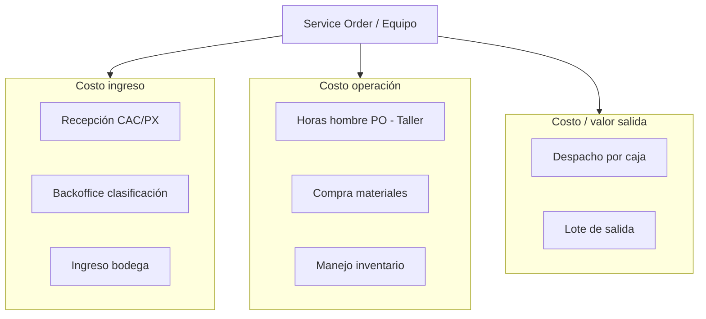

# Módulo: finance-costing

| Campo | Valor |
|-------|-------|
| **Bounded context** | `finance-costing` |
| **Estado doc** | Aprobado negocio — reemplaza modelo pago por actividad |
| **ADR** | ADR-002 D3 |
| **Legacy a deprecar** | `activity_costs` como base de pago (mantener solo referencia) |

---

## Propósito

Análisis económico **por equipo despachado** y por **Lote de Salida**, integrando:

- Costo de **ingreso** del producto (recepción + clasificación + bodega)
- **Manejo de inventario** (almacenamiento, movimientos)
- **Compra de materiales** (repuestos, insumos taller)
- **Horas hombre** imputadas a **PO** (Taller)
- **Ingresos / valor** al **despacho**

**Regla de pago:** Operación paga por **equipo despachado**, no por actividad abstracta.

---

## Lo que NO es este módulo

| No incluye | Dónde |
|------------|-------|
| Contabilidad general (asientos GL) | Futuro `finance-erp` |
| Nómina completa | `rrhh-hrms` |
| SAP FI/CO | Integración externa |

---

## Modelo de costos (capas)

Cada **equipo (OS TC-XXX)** acumula líneas de costo hasta `dispatched`.

---

## Entidades propuestas

### `cost_ledger_entries` (libro analítico)

| Campo | Tipo | Descripción |
|-------|------|-------------|
| `id` | UUID | PK |
| `entry_type` | TEXT | Ver tabla tipos abajo |
| `amount` | NUMERIC | Monto (moneda única fase 1) |
| `currency` | TEXT | Default `GTQ` o configurar |
| `service_order_id` | UUID | FK — equipo |
| `production_order_id` | UUID | FK nullable — HH taller |
| `dispatch_batch_id` | UUID | FK nullable — lote salida |
| `dispatch_id` | UUID | FK nullable — despacho caja |
| `material_purchase_id` | UUID | FK nullable — compra |
| `recorded_at` | TIMESTAMPTZ | |
| `source_module` | TEXT | warehouse, workshop, dispatch, etc. |
| `notes` | TEXT | |

### Tipos `entry_type`

| Código | Descripción | Trigger |
|--------|-------------|---------|
| `INGRESO_RECEPCION` | Costo prorrateado recepción | Clasificación OS |
| `INGRESO_BODEGA` | Costo ingreso físico caja | Warehouse receive |
| `INVENTARIO_CARRY` | Costo días en bodega | Job periódico |
| `MATERIAL_COMPRA` | Repuesto asignado a OS | Taller consume material |
| `HH_TALLER` | Horas hombre × tarifa | Cierre jornada / PO |
| `DESPACHO_UNIT` | **Pago por equipo despachado** | `equipment.dispatched` |
| `ACCESORIO_SALIDA` | Costo accesorio despachado | accessory OUT |

### `material_purchases` (compras)

| Campo | Tipo |
|-------|------|
| `id` | UUID |
| `purchase_order_ref` | TEXT |
| `supplier` | TEXT |
| `total_amount` | NUMERIC |
| `purchased_at` | TIMESTAMPTZ |

### `material_allocations` (asignación OS)

| Campo | Tipo |
|-------|------|
| `material_purchase_id` | UUID |
| `service_order_id` | UUID |
| `quantity` | NUMERIC |
| `allocated_cost` | NUMERIC |

---

## Reglas de negocio

| ID | Regla |
|----|-------|
| R-FC-01 | **Pago operativo** = evento `DESPACHO_UNIT` por OS despachada |
| R-FC-02 | No usar `activity_costs.cost` como tarifa de pago directo |
| R-FC-03 | HH se imputa solo a PO activa en Taller |
| R-FC-04 | Material debe asignarse a OS antes de despacho para costo completo |
| R-FC-05 | Reporte "Costo vs Despacho" = sum(ingreso+operación) vs valor despacho por lote |
| R-FC-06 | Accesorios: línea `ACCESORIO_SALIDA` con/sin `dispatch_batch_id` |

---

## Reportes objetivo

| Reporte | Dimensión |
|---------|-----------|
| Costo vs Despacho | Por `dispatch_batch_id`, período |
| Economía por equipo | Por `service_order_id` |
| Costo ingreso promedio | Por tech/marca/modelo |
| HH por PO | Por `production_order_id` |
| Materiales vs despacho | Compras asignadas vs unidades salidas |

---

## Integraciones

| Módulo | Evento consumido |
|--------|------------------|
| outbound-dispatch | `equipment.dispatched` |
| production-order | PO cerrada → cierre HH |
| workshop | Material consumido |
| accessories-dispatch | accessory OUT |
| rrhh-hrms | Tarifa hora empleado (opcional) |

---

## Migración desde `activity_costs`

| Paso | Acción |
|------|--------|
| 1 | Crear `cost_ledger_entries` |
| 2 | Dashboard costos lee ledger, no `activity_costs` |
| 3 | `activity_costs` → deprecated / solo benchmarks |
| 4 | Configurar tarifas: `dispatch_unit_rates` por tech/modelo |

---

## UI objetivo

| Ruta | Función |
|------|---------|
| `/gestion/costos` | Refactor: análisis costo vs despacho |
| `/gestion/bi` | KPIs reales desde ledger (reemplazar mocks) |

---

## CHG planeados

| ID | Descripción |
|----|-------------|
| CHG-020 | Tablas cost_ledger + material_purchases |
| CHG-021 | Listener equipment.dispatched |
| CHG-022 | Reporte costo vs lote salida |

---

## Referencias

- Legacy: `src/lib/database/costs.ts`, `gestion/costos/page.tsx`
- ADR-002 D3
