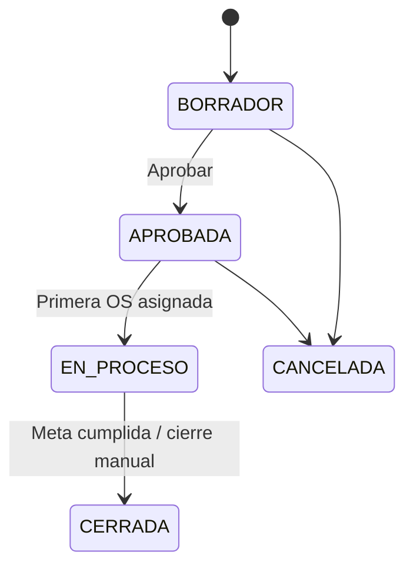

# Módulo: production-order (PO)

| Campo | Valor |
|-------|-------|
| **Bounded context** | `production-order` |
| **Estado doc** | Aprobado negocio — sin implementación |
| **ADR** | ADR-002 D1 |

---

## Propósito

Gestionar **Solicitudes de Producción (PO)** que agrupan trabajo de **Taller** sobre equipos ya **almacenados en Bodega**.

**PO NO aplica a:**
- Recepción CAC/PX
- Clasificación Backoffice
- Creación inicial de OS en manifiesto

---

## Alcance funcional

| Incluye | Excluye |
|---------|---------|
| Crear PO desde Taller | PO en Backoffice |
| Asignar OS/equipos en bodega a PO | Recepción courier |
| Estados PO: borrador → aprobada → en proceso → cerrada | Documento SAP CAC |
| Horas hombre imputables a PO (→ finanzas) | Pago por actividad genérica |
| Consulta futura vía API / Centro Documentos | |

---

## Relación con entidades existentes

```
Bodega (boxes + series IN_CENTRAL_WAREHOUSE)
    → Taller abre PO
    → OS vinculadas a production_order_id
    → Flujo taller (diagnóstico, QC, etc.)
    → Despacho por Caja (módulo outbound-dispatch)
    → Finanzas: costo por equipo despachado
```

---

## Entidad propuesta: `production_orders`

| Campo | Tipo | Descripción |
|-------|------|-------------|
| `id` | UUID | PK |
| `po_number` | TEXT UNIQUE | Ej. `PO-2026-0042` |
| `status` | TEXT | `BORRADOR`, `APROBADA`, `EN_PROCESO`, `CERRADA`, `CANCELADA` |
| `technology_id` | UUID | FK technologies |
| `model_id` | UUID | FK models (opcional) |
| `target_quantity` | INT | Equipos objetivo |
| `warehouse_scope` | TEXT | Siempre `BODEGA_GENERAL` |
| `requested_by` | TEXT | Usuario taller |
| `approved_by` | TEXT | Supervisor |
| `notes` | TEXT | |
| `created_at` | TIMESTAMPTZ | |
| `closed_at` | TIMESTAMPTZ | |

### FK en tablas existentes

| Tabla | Columna nueva |
|-------|---------------|
| `service_orders` | `production_order_id` UUID NULL |
| `workshop_jobs` | `production_order_id` UUID NULL (opcional) |

---

## Reglas de negocio

| ID | Regla |
|----|-------|
| R-PO-01 | PO solo se crea desde módulo Taller |
| R-PO-02 | Solo equipos con `series.current_status` en bodega/taller elegibles |
| R-PO-03 | Una OS pertenece a máximo una PO activa |
| R-PO-04 | Cerrar PO requiere todas OS en estado terminal o despachadas |
| R-PO-05 | HH (horas hombre) se imputan a `production_order_id` para finanzas |

---

## Estados PO



---

## UI objetivo

| Ruta | Función |
|------|---------|
| `/produccion/taller` | Tab "PO" — crear, asignar equipos |
| `/bodega/gestion` | Vista equipos elegibles para PO |
| `/consulta` | Filtro por `po_number` |

---

## Migración (Strangler)

1. Columna `production_order_id` nullable en `service_orders`
2. Equipos legacy sin PO → `po_id` NULL (válido)
3. Nuevos flujos taller requieren PO según política (feature flag)

---

## Documentos relacionados

- ADR-002, ADR-003
- `../outbound-dispatch/README.md`
- `../finance-costing/README.md`
