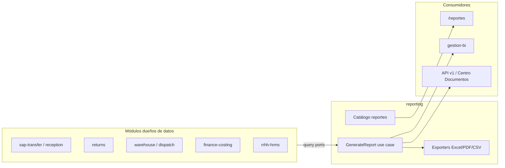

# Módulo: reporting (Reportes)

| Campo | Valor |
|-------|-------|
| **Bounded context** | `reporting` |
| **Estado doc** | Aprobado arquitectura — sin implementación centralizada |
| **ADR** | ADR-004 (hexagonal), ADR-001 Fase 2–3 |
| **Tipo** | **Solo lectura** — no posee flujos transaccionales |

---

## Propósito

**Un solo módulo** para generar, exportar y (futuro) programar **reportes operativos y gerenciales** del ecosistema TC-ERP.

Hoy los reportes están **dispersos** en cada pantalla (Excel embebido en `page.tsx`). El módulo `reporting` centraliza:

- Catálogo de reportes disponibles
- Filtros estándar (fechas, agencia, tecnología, usuario)
- Exportación **Excel / CSV / PDF**
- Consultas vía **ports** a otros módulos (sin duplicar reglas de negocio)
- API para Centro de Documentos y descargas programadas (futuro)

---

## Lo que NO es este módulo

| Módulo | Rol | Diferencia |
|--------|-----|------------|
| `kpi-analytics` | **Calcula** KPIs (productividad, metas) | Motor de métricas en tiempo real |
| `gestion-bi` | **Visualiza** dashboards gerenciales | Gráficos, tendencias — consume reporting + KPI |
| `traceability` | **Consulta** unitaria por serie/OS | Pantalla `/consulta`, no export masivo |
| `finance-costing` | **Escribe** costos en ledger | Reporting solo lee para informes |



---

## Alcance funcional

### Incluye

- Catálogo unificado de reportes por área
- Generación bajo demanda (usuario elige filtros → descarga)
- Formato Excel (prioridad), CSV, PDF (fase 2)
- Permisos por rol / reporte
- Registro de auditoría: quién generó qué reporte y cuándo
- Reutilizar queries existentes vía ports (no SQL en UI)

### No incluye (fase 1)

- ETL a data warehouse externo
- Report designer drag-and-drop
- Envío email automático (fase 3)
- Modificar datos — siempre read-only

---

## Arquitectura hexagonal (ADR-004)

```
src/modules/reporting/
├── domain/
│   ├── entities/
│   │   ├── report-definition.entity.ts    # id, nombre, categoría, columnas
│   │   └── report-run.entity.ts           # ejecución: filtros, usuario, estado
│   ├── value-objects/
│   │   ├── report-filter.vo.ts
│   │   ├── date-range.vo.ts
│   │   └── export-format.enum.ts          # XLSX | CSV | PDF
│   └── ports/
│       ├── report-data-provider.port.ts   # genérico por reportId
│       ├── report-exporter.port.ts        # toFile(buffer), mimeType
│       └── report-run.repository.port.ts  # persistir ejecuciones (opcional)
│
├── application/
│   ├── queries/
│   │   ├── list-report-catalog.handler.ts
│   │   └── get-report-preview.handler.ts  # primeras N filas en UI
│   └── commands/
│       └── generate-report.handler.ts
│
├── infrastructure/
│   ├── exporters/
│   │   ├── xlsx-report.exporter.ts
│   │   ├── csv-report.exporter.ts
│   │   └── pdf-report.exporter.ts         # fase 2
│   ├── providers/                         # adaptadores por dominio
│   │   ├── cac-history-report.provider.ts
│   │   ├── reception-history.provider.ts
│   │   ├── dispatch-pending.provider.ts
│   │   ├── returns-summary.provider.ts
│   │   ├── inventory-snapshot.provider.ts
│   │   ├── cost-vs-dispatch.provider.ts   # cuando exista finance-costing
│   │   └── rrhh-attendance.provider.ts
│   └── persistence/
│       └── supabase-report-run.repository.ts
│
└── interfaces/
    ├── api/
    │   └── reports.route-handler.ts       # GET /api/v1/reports/{id}/export
    └── hooks/
        └── use-generate-report.ts
```

**Regla:** `infrastructure/providers/*` delega a casos de uso o repositorios de lectura de otros módulos — **no** copia reglas de clasificación, devolución, etc.

---

## Tablas propias (mínimas)

| Tabla | Rol |
|-------|-----|
| `report_definitions` | Catálogo: código, nombre, categoría, columnas JSON, roles permitidos |
| `report_runs` | Historial ejecuciones: user, filtros, formato, status, file_url opcional |
| `report_saved_filters` | Filtros guardados por usuario (fase 2) |

Los **datos del reporte** viven en tablas de otros módulos (`receptions`, `service_orders`, `dispatches`, etc.).

---

## Reglas de negocio

| ID | Regla |
|----|-------|
| R-RP-01 | Todo reporte es **solo lectura** — prohibido INSERT/UPDATE en providers |
| R-RP-02 | Filtro fecha obligatorio si el reporte supera 10k filas estimadas |
| R-RP-03 | Exportación registra `report_runs` con usuario y timestamp |
| R-RP-04 | Rol sin permiso → 403; no filtrar silenciosamente |
| R-RP-05 | Columnas y etiquetas según `glossary.md` (Guía, Documento SAP, OS TC-XXX) |
| R-RP-06 | Datos legacy en `notes` → provider usa capa anti-corrupción, no parse en UI |
| R-RP-07 | Reportes financieros requieren módulo `finance-costing` activo |
| R-RP-08 | Máximo 50k filas por export síncrono; mayor → job asíncrono (fase 3) |

---

## Catálogo de reportes

Ver detalle completo: [`report-catalog.md`](report-catalog.md).

| Categoría | Ejemplos | Fuente datos hoy |
|-----------|----------|------------------|
| **CAC / Recepción** | Histórico CAC, Histórico PX, Manifiesto | `receptions`, backoffice |
| **Clasificación** | Equipos clasificados por período | `service_orders`, `series`, `sap_transfer_documents` |
| **Logística** | Devoluciones, pendientes SAP | `returns`, `sap_transfer_documents` |
| **Bodega** | Inventario cajas, stock accesorios | `boxes`, `accessories` |
| **Despacho** | Pendientes, despachados por período | `dispatches`, `dispatch_items` |
| **Despacho (futuro)** | Por Lote de Salida | `dispatch_batches` |
| **Taller / PO (futuro)** | Equipos por PO, HH por PO | `production_orders` |
| **Finanzas (futuro)** | Costo vs despacho, materiales | `cost_ledger_entries` |
| **RRHH** | Asistencia, ausencias, tardanzas, planilla | `employees`, `zk_raw_logs` |
| **SAP** | Diferencias archivo vs TC, no validados | `sap_validation_*` |
| **Trazabilidad** | Movimientos por serie/OS (export) | `audit`, `series` |

---

## Estado legacy (disperso hoy)

| Ubicación actual | Reporte | Migrar a |
|------------------|---------|----------|
| `backoffice/page.tsx` `handleExportReport` | Histórico CAC Excel | `CAC_HISTORICO` |
| `recepcion/HistoryTab.tsx` | Histórico CAC/PX | `RECEPCION_HISTORICO` |
| `despacho/page.tsx` | Despachos pendientes | `DESPACHO_PENDIENTES` |
| `bodega/inventario/page.tsx` | Inventario bodega | `INVENTARIO_CAJAS` |
| `rrhh/ReportesTab.tsx` | Asistencia, ausencias, etc. | `RRHH_*` |
| `rrhh/PlanillaTab.tsx` | Nómina quincenal | `RRHH_PLANILLA` |
| `gestion/bi/page.tsx` | Dashboard mock | `gestion-bi` consume KPI + reporting |

**Strangler:** cada pantalla mantiene botón export; internamente llama `GenerateReportHandler` con feature flag `USE_CENTRAL_REPORTING`.

---

## UI objetivo

| Ruta | Función |
|------|---------|
| `/reportes` | Portal único: categorías, filtros, vista previa, descarga |
| `/gestion/bi` | Dashboards — enlaces "Exportar detalle" → reporting |
| Botones legacy | Delegan al mismo handler (sin duplicar XLSX) |

---

## Integraciones

| Módulo | Port / contrato |
|--------|-----------------|
| sap-transfer | `ICacClassificationReportPort` |
| returns | `IReturnsSummaryReportPort` |
| outbound-dispatch | `IDispatchReportPort` |
| finance-costing | `ICostAnalysisReportPort` |
| rrhh-hrms | `IAttendanceReportPort` |
| platform/audit | Log `REPORTE_GENERADO` |
| ADR-003 API | `GET /api/v1/reports/{code}/export` |

---

## Escalabilidad

| Necesidad | Solución hexagonal |
|-----------|-------------------|
| Nuevo reporte | Nueva `ReportDefinition` + provider adapter |
| Cambio columnas CAC | Solo provider CAC — UI catálogo metadata |
| Reporte pesado | `GenerateReportAsync` + worker (nuevo driving adapter) |
| Microservicio BI futuro | HTTP provider; domain reporting igual |
| Centro Documentos | API route como driving adapter |

---

## CHG planeados

| ID | Descripción | Fase |
|----|-------------|------|
| CHG-050 | Tablas `report_definitions`, `report_runs` + catálogo seed | 2 |
| CHG-051 | Módulo hexagonal + exporters XLSX/CSV | 2 |
| CHG-052 | Migrar reporte CAC histórico (backoffice) | 2 |
| CHG-053 | Portal `/reportes` | 2 |
| CHG-054 | Migrar RRHH + despacho + inventario | 3 |
| CHG-055 | API v1 export + jobs asíncronos | 3 |
| CHG-056 | Reportes finanzas + lote salida + PO | 3 |

---

## Métricas

| KPI | Descripción |
|-----|-------------|
| Reportes centralizados / total | % migrados desde UI dispersa |
| Tiempo generación p95 | Por categoría de reporte |
| Errores export | Fallos provider o timeout |
| Uso por rol | Auditoría `report_runs` |

---

## Referencias

- Catálogo: [`report-catalog.md`](report-catalog.md)
- Hexagonal: [`../../architecture/hexagonal-layout.md`](../../architecture/hexagonal-layout.md)
- KPI (complementario): `kpi-engine.ts`, módulo futuro `kpi-analytics`
- BI mock: `gestion/bi/page.tsx`
