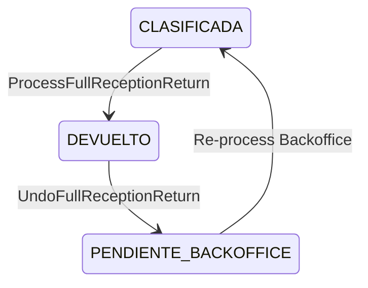
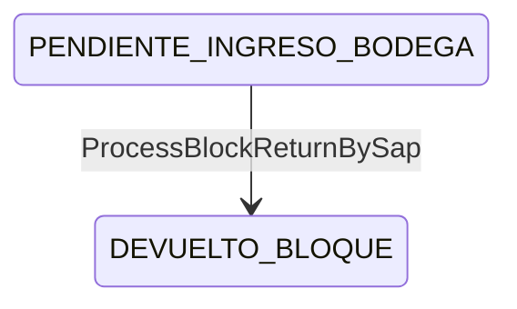

# returns — Máquina de estados

**Versión:** 1.0 — Transiciones en tres entidades coordinadas

---

## 1. Series (`current_status`)

### Transición principal

```
RECEPCIONADO_BODEGA_GENERAL  →  RETURNED (returned)
         ↑                              │
         └──────── UNDO (UC-RN-04) ─────┘
              (restore PrevStatus or CLASIFICADA)
```

### Otras entradas a RETURNED

- Desde cualquier estado previo en devolución lote (UC-RN-02) — **sin validación estricta de gate**.

---

## 2. Reception (`status`)



| Estado post-devolución | Bandeja Backoffice |
|------------------------|-------------------|
| `DEVUELTO` | Excluido |
| `PENDIENTE_BACKOFFICE` | Visible (revertido) |

---

## 3. SapTransferDocument (`status`)



**Precondición:** todas las series del doc en `RECEPCIONADO_BODEGA_GENERAL` (R-RN-12).

**Post:** series RETURNED, OS DEVUELTO, SAP doc DEVUELTO_BLOQUE.

---

## 4. ServiceOrder (`status`)

```
INGRESADO  →  DEVUELTO   (solo en devolución bloque, R-RN-33)
```

Devolución individual **no** actualiza OS hoy — gap documentado.

---

## 5. Diagrama coordinado (bloque SAP)

```
┌─────────────────┐     ┌──────────────┐     ┌─────────────────┐
│  Series (N)     │     │ ServiceOrder │     │ SapTransferDoc  │
│  → RETURNED     │     │ → DEVUELTO   │     │ → DEVUELTO_BLOQUE│
└─────────────────┘     └──────────────┘     └─────────────────┘
         │                       │                      │
         └───────────────────────┴──────────────────────┘
                    Una operación lógica (UC-RN-03)
                    Objetivo: una TX (CHG-004)
```

---

## 6. UI estados (devoluciones grid — no persistidos en DB)

| UI Status | Significado |
|-----------|-------------|
| `Pendiente` | En bandeja |
| `Procesado` | Devolución aplicada |
| `Rechazado` | Descartado |

**Nota:** Derivan de lógica page, no columnas DB.

---

## Referencias

- SAP states: `../sap-transfer/state-machine.md`
- Catálogo: `../../architecture/entity-status-catalog.md`
