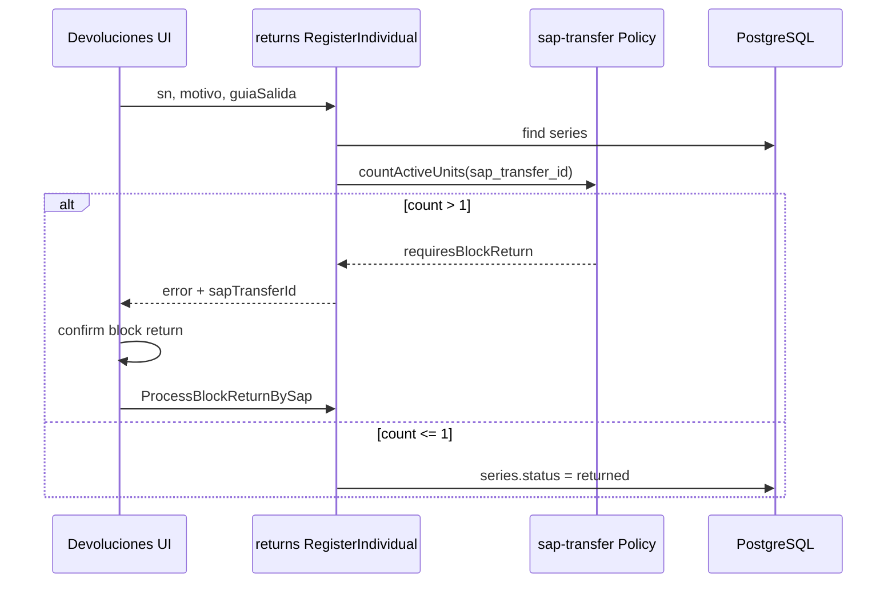
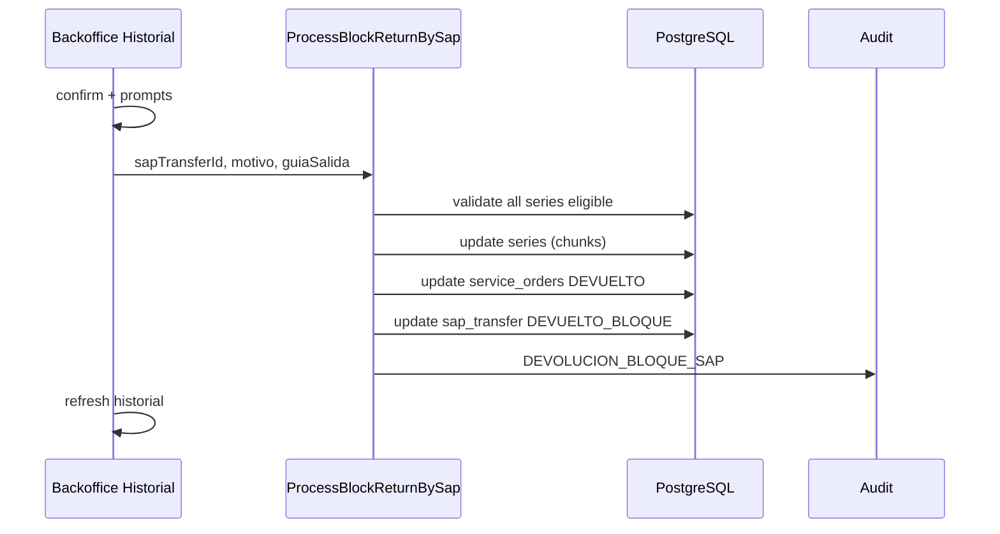

# Integración: sap-transfer ↔ returns

**Versión:** 1.0 | Módulos piloto ADR-001

---

## 1. Relación de dominio

```
SapTransferDocument (1) ──< Series (N) ──> ServiceOrder (1)
         │
         └── Block Return opera sobre TODAS las series del documento
```

**Regla central:** No se puede devolver **una** unidad si el documento SAP tiene **más de una** unidad activa en `RECEPCIONADO_BODEGA_GENERAL` (R-RN-10, R-RN-11).

---

## 2. Contrato entre módulos (objetivo Fase 2)

### Puerto: `SapTransferReturnPort`

| Método | Responsabilidad | Implementador |
|--------|-----------------|---------------|
| `countActiveUnits(sapTransferId)` | Count elegibles | sap-transfer infra |
| `getDocument(sapTransferId)` | Metadata SAP | sap-transfer infra |
| `executeBlockReturn(request)` | TX completa | sap-transfer infra |

### Consumidor: `returns.application`

- `RegisterIndividualReturn` → llama `countActiveUnits` antes de permitir individual.
- `ProcessBlockReturnBySap` → delega `executeBlockReturn`.

**Hoy:** `returns.ts` importa `processBlockReturnBySapTransfer` desde `sapTransfers.ts` directamente.

---

## 3. Flujo: Devolución individual → bloque obligatorio



---

## 4. Flujo: Block return desde Backoffice historial



---

## 5. Estados sincronizados post-bloque

| Entidad | Estado final |
|---------|--------------|
| `series` (N) | `returned` |
| `service_orders` (M) | `DEVUELTO` |
| `sap_transfer_documents` (1) | `DEVUELTO_BLOQUE` |
| `receptions` | Sin cambio en bloque SAP puro |

**Nota:** Devolución lote (UC-RN-02) sí cambia `receptions.status`.

---

## 6. Puntos de acoplamiento actuales (a resolver)

| Acoplamiento | Problema | Solución Fase 2 |
|--------------|----------|-----------------|
| `returns` imports `sapTransfers` | Violación bounded context | Puerto + DI |
| Block logic en sapTransfers.ts | Returns no es dueño | Mover a `sap-transfer/application` |
| Validación estado en TS cliente | Bypass posible | RPC SECURITY DEFINER |
| Chunks sin TX | Estado parcial | CHG-004 single TX |

---

## 7. CHGs coordinados

| CHG | sap-transfer | returns |
|-----|--------------|---------|
| CHG-001 | classify TX RPC | — |
| CHG-004 | provee block TX RPC | consume block TX |
| CHG-006 | implementa port | consume port |

**Regla:** No implementar CHG-004 sin revisar impacto conjunto en plantilla impacto.

---

## 8. Prueba integrada E2E (paridad)

Escenario **PRUEBAS-06**:

1. Clasificar N equipos bajo mismo SAP doc (UC-ST-02).
2. Verificar historial N filas mismo `unitSap`.
3. Intentar devolución individual → reject R-RN-11.
4. Ejecutar block return → todos DEVUELTO_BLOQUE.
5. Historial muestra estado Devuelto.
6. Audit `DEVOLUCION_BLOQUE_SAP` presente.

---

## Referencias

- sap-transfer: `../sap-transfer/README.md`
- returns: `../returns/README.md`
- ADR-001: `../../architecture/ADR-001-monolith-modular-evolution.md`
