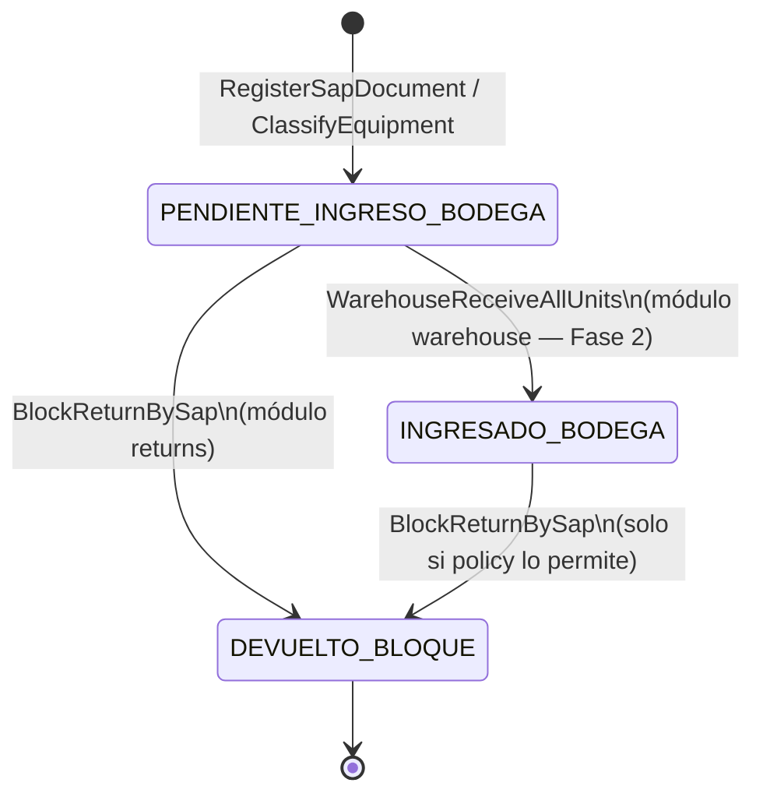

# sap-transfer — Máquina de estados

**Entidad:** `SapTransferDocument.status`  
**Versión:** 1.0

---

## 1. Estados

| Código | Label UI | Terminal | Descripción |
|--------|----------|----------|-------------|
| `PENDIENTE_INGRESO_BODEGA` | Pendiente ingreso bodega | No | Default al crear; equipos clasificados |
| `INGRESADO_BODEGA` | Ingresado bodega | No | Todas las series del doc en bodega central |
| `DEVUELTO_BLOQUE` | Devuelto (bloque) | Sí | Devolución masiva por SAP doc |

---

## 2. Diagrama de transiciones

---

## 3. Precondiciones por transición

### `→ PENDIENTE_INGRESO_BODEGA`

| Trigger | Actor |
|---------|-------|
| `RegisterSapDocument` | Backoffice operador |
| Default en INSERT / RPC | Sistema |

### `PENDIENTE_INGRESO_BODEGA → INGRESADO_BODEGA`

| Precondición | Responsable |
|--------------|-------------|
| Todas las series con `sap_transfer_id = X` en `IN_CENTRAL_WAREHOUSE` | `warehouse` (no implementado) |
| Ninguna serie en estado anterior a bodega | Validación domain |

**Gap actual:** transición no implementada. Series pasan a `in_central_warehouse` sin actualizar SAP doc.

### `* → DEVUELTO_BLOQUE`

| Precondición | Regla |
|--------------|-------|
| Todas las series del doc en `RECEPCIONADO_BODEGA_GENERAL` | R-RN-12 |
| Motivo y guía salida capturados | R-RN-20 |
| Actor autorizado | RLS + roles |

Ver módulo `returns`.

---

## 4. Coherencia con estados de series

| SAP doc status | Series esperadas (canónico) |
|----------------|----------------------------|
| `PENDIENTE_INGRESO_BODEGA` | `RECEPCIONADO_BODEGA_GENERAL` |
| `INGRESADO_BODEGA` | `IN_CENTRAL_WAREHOUSE` |
| `DEVUELTO_BLOQUE` | `RETURNED` |

**Regla de integridad (objetivo):** trigger o job detecta divergencia SAP doc vs series.

---

## 5. Eventos de dominio por transición

| Transición | Evento |
|------------|--------|
| Creación | `SapTransferRegisteredEvent` |
| Clasificación equipos | `EquipmentClassifiedEvent` (por unidad o batch) |
| → INGRESADO_BODEGA | `SapTransferWarehouseReceivedEvent` (futuro) |
| → DEVUELTO_BLOQUE | `SapTransferBlockReturnedEvent` |

---

## 6. Legacy / gaps

| Gap | Impacto | CHG planeado |
|-----|---------|--------------|
| ~~`INGRESADO_BODEGA` nunca seteado~~ | ✓ Resuelto — sync al encajonar 100% de series en bodega | [CHG-002](../../changes/CHG-002-warehouse-sap-sync.md) (impl.) |
| Dos vocabularios "ingresado" | Confusión KPI | Unificar via catálogo |

---

## Referencias

- Catálogo global: `../../architecture/entity-status-catalog.md`
- Returns state: `../returns/state-machine.md`
